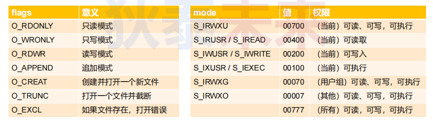

- [Linux文件原生操作](#linux文件原生操作)
  - [Linux中的文件描述符](#linux中的文件描述符)
  - [实验](#实验)


# Linux文件原生操作

Linux中一切皆文件，那Linux的文件是什么呢？
* 可以是传统意义上，有序数据集合，即文件系统的物理文件
* 也可以是：设备，管道，内存等等

> Linux利用VFS(虚拟文件系统)机制，将设备以"文件"方式挂载到文件系统中，对外提供跟文件操作一致的接口

## Linux中的文件描述符

* 文件描述符是一个整数值，被用于内核标识已经打开的文件或者其他I/O资源
* 当打开一个文件，系统会分配一个唯一文件描述符用于标识文件
* 文件描述符范围一般是[0, 1023]
  * 0, 1, 2 被系统占用，分别是标准输入，标准输出，标准错误
  * 进程中可用的文件描述符范围是[3, 1023]

```C
#include <sys/types.h>
#include <sys/stat.h>
#include <fcntl.h>
#include <unistd.h>

/* Open FILE and return a new file descriptor for it, or -1 on error.
   OFLAG determines the type of access used.  If O_CREAT or O_TMPFILE is set
   in OFLAG, the third argument is taken as a `mode_t', the mode of the
   created file.

   This function is a cancellation point and therefore not marked with
   __THROW.  */
extern int open (const char *__file, int __oflag, ...) __nonnull ((1));
// int open (const char *__file, int __oflag);
// or
// int open (const char *__file, int __oflag, mode_t mode);

/* Close the file descriptor FD.

   This function is a cancellation point and therefore not marked with
   __THROW.  */
extern int close (int __fd);

/* Create and open FILE, with mode MODE.  This takes an `int' MODE
   argument because that is what `mode_t' will be widened to.

   This function is a cancellation point and therefore not marked with
   __THROW.  */
extern int creat (const char *__file, mode_t __mode) __nonnull ((1));
```



```C
/* Read NBYTES into BUF from FD.  Return the
   number read, -1 for errors or 0 for EOF.

   This function is a cancellation point and therefore not marked with
   __THROW.  */
extern ssize_t read (int __fd, void *__buf, size_t __nbytes) __wur;

/* Write N bytes of BUF to FD.  Return the number written, or -1.

   This function is a cancellation point and therefore not marked with
   __THROW.  */
extern ssize_t write (int __fd, const void *__buf, size_t __n) __wur;

/* Move FD's file position to OFFSET bytes from the
   beginning of the file (if WHENCE is SEEK_SET),
   the current position (if WHENCE is SEEK_CUR),
   or the end of the file (if WHENCE is SEEK_END).
   Return the new file position.  */
extern __off_t lseek (int __fd, __off_t __offset, int __whence) __THROW;

// # define SEEK_SET	0	/* Seek from beginning of file.  */
// # define SEEK_CUR	1	/* Seek from current position.  */
// # define SEEK_END	2	/* Seek from end of file.  */
```

## 实验

需求：
* 创建一个可以存储“无限”个元素的数组
* 数组可以动态扩大，即可以追加元素
* 提供统一访问方式：以0下标开始

一般来说，在Linux C 语言环境下，数组要么是预定义的即在定义时候就要规定数组大小
要么是动态申请内存方式，不过也是要规定空间大小，所以以传统方式是不能够满足当前需求的

对于普通数组，因为是预定义好了大小，并且是在内存中，那么：
* 其访问速度是很快，但是空间大小有限制  
  
如果要实现无限扩大，那么：
* 可以考虑将数据存储到外存中
* 可以把数据存到文件中，其访问速度会下降，但是数组大小不会限制

```C
#ifndef EARRAY_H
#define EARRAY_H

typedef void EArray;

#define EArray_init(type, cnt) EArray_init_(cnt, sizeof(type))

#define EArray_set(arr, type, index, val) ({      \
    type v = val;                                 \
    int ret = EArray_set_(arr, index, (void*)&v); \
    ret;                                          \
})

#define EArray_get(arr, type, index) ({    \
    type r;                                \
    int ret = EArray_get_(arr, index, &r); \
    r;                                     \
})

#define EArray_append(arr, type, val) ({  \
    type v = val;                         \
    EArray_append_(arr, &v);              \
})

EArray* EArray_init_(unsigned int cnt, unsigned int size);

int EArray_set_(EArray* ea, unsigned int index, const void* buf);

int EArray_get_(EArray* ea, unsigned int index, void* buf);

int EArray_append_(EArray* ea, const void* buf);

int EArray_length(EArray* ea);

void EArray_release(EArray* ea);

#endif
```

```C
#include <stdlib.h>
#include <stdio.h>
#include <unistd.h>
#include <sys/types.h>
#include <sys/stat.h>
#include <sys/time.h>
#include <fcntl.h>
#include <errno.h>
#include "EArray.h"

typedef struct
{
    int fd;
    int length;
    int block_size;
    char name[32];
}_EArray;

EArray* EArray_init_(unsigned int cnt, unsigned int size)
{
    _EArray* ea = (EArray*)calloc(cnt, size);

    if(ea)
    {
        struct timeval t = {0};

        gettimeofday(&t, NULL);

        sprintf(ea->name, "%ld_%ld.tmp", t.tv_sec, t.tv_usec/1000);

        ea->fd = open(ea->name, O_CREAT | O_RDWR, S_IRUSR | S_IWUSR);

        if(ea->fd < 0)
        {
            free(ea);
            ea = NULL;
        }
        else
        {
            ea->length = cnt;
            ea->block_size = size;
        }
    }

    return ea;
}

int EArray_set_(EArray* ea, unsigned int index, const void* buf)
{
    int ret = 0;
    _EArray* e = (_EArray*)ea;

    if(e && buf && (index < e->length))
    {
        lseek(e->fd, index * e->block_size, SEEK_SET);
        
        ret = write(e->fd, buf, e->block_size);
    }

    return ret;
}

int EArray_get_(EArray* ea, unsigned int index, void* buf)
{
    int ret = 0;
    _EArray* e = (_EArray*)ea;

    if(e && buf && (index < e->length))
    {
        lseek(e->fd, index * e->block_size, SEEK_SET);

        ret = read(e->fd, buf, e->block_size);
    }

    return ret;
}

int EArray_append_(EArray* ea, const void* buf)
{
    int ret = 0;
    _EArray* e = (_EArray*)ea;

    if(e && buf)
    {
        ret += write(e->fd, buf, e->block_size);

        e->length++;
    }
}

int EArray_length(EArray* ea)
{
    _EArray* e = (_EArray*)ea;

    return e ? e->length : -1;
}

void EArray_release(EArray* ea)
{
    _EArray* e = (_EArray*)ea;

    if(e)
    {
        close(e->fd);
        unlink(e->name);
        free(ea);
    }
}
```

# Linux一切皆文件

ASCII C文件操作  
* ```stdin```标准输入，```stdout```标准输出，```stderr```标准错误  
Linux文件操作  
* 1 显示设备，0 输入设备，2错误设备  
> 可以通过文件操作方式对设备进行输入输出