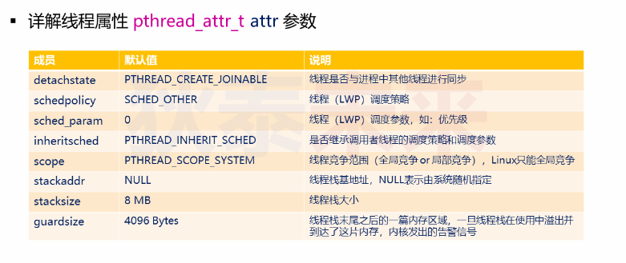
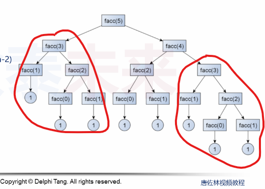

- [Linux线程API详解](#linux线程api详解)
  - [再论线程创建](#再论线程创建)
  - [线程属性 ```pthread_attr_t```参数](#线程属性-pthread_attr_t参数)
  - [线程结束方式](#线程结束方式)
    - [线程的返回值](#线程的返回值)
  - [实验](#实验)


# Linux线程API详解

## 再论线程创建

```C
 #include <pthread.h>

// Compile and link with -pthread.
// thread: 存储线程ID
// attr: 线程属性，如果是NULL, 则使用默认属性
// start_routine: 线程执行函数
// arg: 传入线程入口函数的参数
// retrutn :
//  0 成功，
//  EAGAIN 系统资源不够或者线程数超过限制
//  EINVAL 属性设置不合法
//  EPERM  权限不够
int pthread_create(pthread_t *thread, const pthread_attr_t *attr,
                    void *(*start_routine) (void *), void *arg);
```
## 线程属性 ```pthread_attr_t```参数
在Linux中```pthread_attr_t```**可能的定义类型**
这里只是一种猜测。


在Linux系统中线程的API遵循POSIX标准，各家系统在实现细节是不一样的，  
那么在设置属性时候，是不能直接以结构体访问方式去设置的



所以就需要使用POSIX提供的接口进行设置

实验实例

```C
#include <pthread.h>
// Compile and link with -pthread

int pthread_attr_init(pthread_attr_t *attr);
int pthread_attr_destroy(pthread_attr_t *attr);

#define _GNU_SOURCE
int pthread_attr_setxxx(pthread_attr_t *attr, type xxx);
int pthread_attr_getxxx(pthread_attr_t *attr, type xxx);
```

```C

#define _GNU_SOURCE     /* To get pthread_getattr_np() declaration */
#include <pthread.h>
#include <stdio.h>
#include <stdlib.h>
#include <unistd.h>
#include <errno.h>
        
static void print_attr(char* prefix, pthread_attr_t* attr)
{
    int r = 0;
    int i = 0;
    size_t v = 0;
    void* stkaddr = NULL;
    struct sched_param sp = {0};

    r = pthread_attr_getdetachstate(attr, &i);         
    printf("%s - Detach state(%d)        = %s\n", prefix, r,
                   (i == PTHREAD_CREATE_DETACHED) ? "PTHREAD_CREATE_DETACHED" :
                   (i == PTHREAD_CREATE_JOINABLE) ? "PTHREAD_CREATE_JOINABLE" :
                   "???");

    r = pthread_attr_getscope(attr, &i);        
    printf("%s - Scope(%d)               = %s\n", prefix, r,
                   (i == PTHREAD_SCOPE_SYSTEM)  ? "PTHREAD_SCOPE_SYSTEM" :
                   (i == PTHREAD_SCOPE_PROCESS) ? "PTHREAD_SCOPE_PROCESS" :
                   "???");

    r = pthread_attr_getinheritsched(attr, &i);
    printf("%s - Inherit scheduler(%d)   = %s\n", prefix, r,
                   (i == PTHREAD_INHERIT_SCHED)  ? "PTHREAD_INHERIT_SCHED" :
                   (i == PTHREAD_EXPLICIT_SCHED) ? "PTHREAD_EXPLICIT_SCHED" :
                   "???");

    r = pthread_attr_getschedpolicy(attr, &i);
    printf("%s - Scheduling policy(%d)   = %s\n", prefix, r,
                   (i == SCHED_OTHER) ? "SCHED_OTHER" :
                   (i == SCHED_FIFO)  ? "SCHED_FIFO" :
                   (i == SCHED_RR)    ? "SCHED_RR" :
                   "???");

    r = pthread_attr_getschedparam(attr, &sp);
    printf("%s - Scheduling priority(%d) = %d\n", prefix, r, sp.sched_priority);

    r = pthread_attr_getguardsize(attr, &v);
    printf("%s - Guard size(%d)          = 0x%lx bytes\n", prefix, r, v);

    r = pthread_attr_getstack(attr, &stkaddr, &v);
    printf("%s - Stack address(%d)       = %p\n", prefix, r, stkaddr);
    printf("%s - Stack size(%d)          = 0x%lx bytes\n", prefix, r, v);
}

void* thread_entry(void* arg)
{   
    pthread_attr_t attr = {0};
    
    printf("thread: %ld\n", pthread_self());
    
    pthread_getattr_np(pthread_self(), &attr);
    
    print_attr("thread", &attr);

    return NULL;
}

int main()
{
    pthread_t t = {0};
    pthread_attr_t attr = {0};
    int r = 0;
    
    pthread_attr_init(&attr);

    print_attr("init", &attr);
    
    r = pthread_attr_setstacksize(&attr, 4 * 1024);
    
    pthread_create(&t, &attr, thread_entry, NULL);
    
    pthread_join(t, NULL);
    
    pthread_getattr_np(pthread_self(), &attr);
    
    print_attr("main", &attr);
    
    pthread_attr_destroy(&attr);
    
    return 0;
}
```

## 线程结束方式

* 线程入口函数执行```return```语句
* 线程执行流调用```pthread_exit```函数
* 其他线程对指定线程执行```pthread_cancel```函数(不安全)
> pthread_cancel是不安全的，因为线程内可能申请了资源，执行pthread_cancel会直接结束线程
> ，让资源无法被释放

### 线程的返回值
* 基础类型
* 结构体类型：利用全局变量或者利用堆空间返回
* 字符串返回值：返回字面量或者静态字符串

可以看到线程的返回值，就是值返回

**那么，返回值怎么获取呢**

```C
#include <pthread.h>

// thread：指定线程ID
// retval：存储返回值
int pthread_join(pthread_t thread, void **retval);

//Compile and link with -pthread.
```

* 用于等待指定线程结束  
* 如果线程已经结束，那么会立即返回
* 如果指定线程不可连接，那么会返回错误

> 注意：如果多个线程同时 join到同一个线程，那么结果是未定义的！！

## 实验
利用多线程解决斐波那契数列

```C
#define _GNU_SOURCE     /* To get pthread_getattr_np() declaration */
#include <pthread.h>
#include <stdio.h>
#include <stdlib.h>
#include <unistd.h>
#include <memory.h>
        
void* thread_facc(void* arg)
{   
    long long n = (long long)arg;
    long long ret = 0;
    
    if( n > 1 )
    {
        pthread_t t1 = {0};
        pthread_t t2 = {0};
        void* r1 = 0;
        void* r2 = 0;
        
        pthread_create(&t1, NULL, thread_facc, (void*)(n-1));
        pthread_create(&t2, NULL, thread_facc, (void*)(n-2));
        
        pthread_join(t1, &r1);
        pthread_join(t2, &r2);
        
        ret += (long long)r1 + (long long)r2;
    }
    else
    {
        ret = 1;
    }
    
    return (void*)ret;
}

int main()
{
    pthread_t t = 0;
    void* ret = 0;
    
    pthread_create(&t, NULL, thread_facc, (void*)10);
    
    pthread_join(t, &ret);
    
    printf("ret = %lld\n", (long long)ret);
    
    return 0;
}
```

上述代码，可以成功运行并输出结果。但是，当输入参数很大比如30时候，这时候就会出现问题并返回段错误了，是什么原因呢？

**是因为，当n很大时候，就需要创建非常多线程，那么就有可能出现资源不足问题了，那么该怎么优化呢？**

思路：

在执行多线程往下求值时，其实会出现很多重复项，为了并避免重复计算，减少线程创建，可以利用缓存，把已经求好的值存储到缓存中，避免重复创建线程，提高效率



```C
#include <stdio.h>
#include <stdlib.h>
#include <unistd.h>
#include <string.h>
#include <pthread.h>

typedef struct 
{
    int i;
    int* cache;
    /* data */
}List;

static int* gCache;

void* thread_facc(void* arg)
{
    long long i = (long long)arg;
    long long ret = 0;

    if(gCache[i] == 0)
    {
        pthread_t t1;
        pthread_t t2;

        pthread_create(&t2, NULL, thread_facc, (void*)i-2);
        usleep(i * 500);
        pthread_create(&t1, NULL, thread_facc, (void*)i-1);

        pthread_join(t2, NULL);
        pthread_join(t1, NULL);

        gCache[i] = gCache[i-1] + gCache[i-2]; 

        //printf("gCache[%d]:%d\n", i, gCache[i]);
    }

    return NULL;
}

void* thread_facc2(void* arg)
{
    List* l = (List*)arg;
    int index = l->i;

    if(l->cache[index] == 0)
    {
        pthread_t t1;
        pthread_t t2;
        List c1 = {index-1, l->cache};
        List c2 = {index-2, l->cache};

        pthread_create(&t2, NULL, thread_facc2, (void*)&c2);
        usleep(index * 500);
        pthread_create(&t1, NULL, thread_facc2, (void*)&c1);

        pthread_join(t2, NULL);
        pthread_join(t1, NULL);

        l->cache[index] = l->cache[index-1] + l->cache[index-2];

        // printf("cache[%d]:%d\n", index, l->cache[index]);
    }

    return NULL;
}

int main(int argc, char* argv[])
{
    long long num = 1;
    pthread_t tid;
    List che = {0, NULL};

    if(argc > 1)
    {
        num = atoi(argv[1]);
    }

    che.i = num;
    che.cache = (int*)calloc(num+1, sizeof(int));
    gCache = (int*)calloc(num+1, sizeof(int));

    gCache[0] = 1;
    gCache[1] = 1;

    che.cache[0] = 1;
    che.cache[1] = 1;

    // pthread_create(&tid, NULL, thread_facc, (void*)num);
    pthread_create(&tid, NULL, thread_facc2, (void*)&che);

    pthread_join(tid, NULL);

    // printf("ret = %d\n", gCache[num]);
    printf("ret = %d\n", che.cache[num]);

    return 0;
}
```