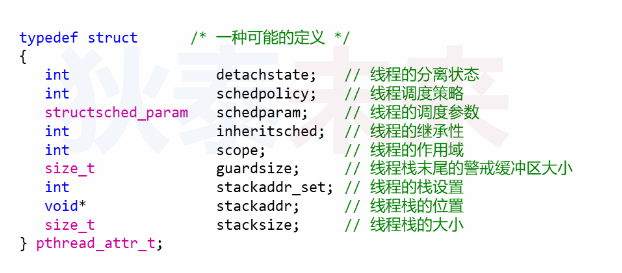

- [Linux线程API详解](#linux线程api详解)
  - [再论线程创建](#再论线程创建)
  - [线程属性 ```pthread_attr_t```参数](#线程属性-pthread_attr_t参数)


# Linux线程API详解

## 再论线程创建

```C
 #include <pthread.h>

// Compile and link with -pthread.
// thread: 存储线程ID
// attr: 线程属性，如果是NULL, 则使用默认属性
// start_routine: 线程执行函数
// arg: 传入线程入口函数的参数
// retrutn :
//  0 成功，
//  EAGAIN 系统资源不够或者线程数超过限制
//  EINVAL 属性设置不合法
//  EPERM  权限不够
int pthread_create(pthread_t *thread, const pthread_attr_t *attr,
                    void *(*start_routine) (void *), void *arg);
```
## 线程属性 ```pthread_attr_t```参数
在Linux中```pthread_attr_t```**可能的定义类型**




在Linux系统中线程的API遵循POSIX标准，各家系统在实现细节是不一样的，  
那么在设置属性时候，是不能直接以结构体访问方式去设置的

