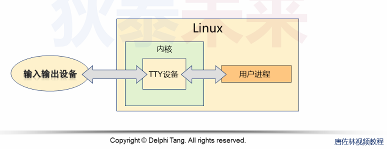
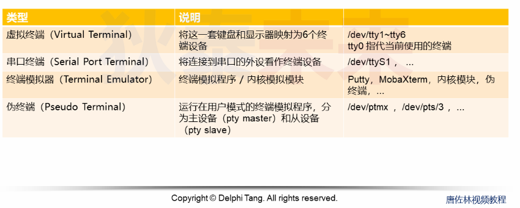
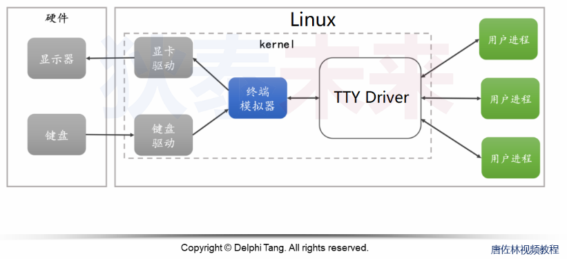
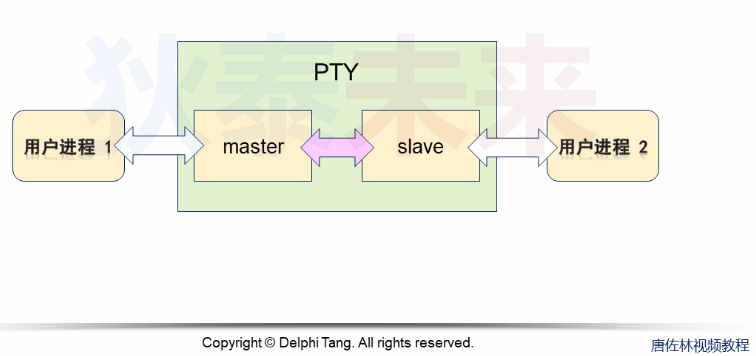
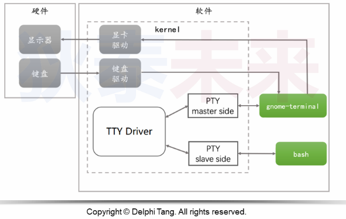

- [Linux进程与终端](#linux进程与终端)
  - [问题](#问题)
    - [背景回顾](#背景回顾)
    - [控制台VS终端](#控制台vs终端)
  - [终端与进程](#终端与进程)
    - [伪终端程序设计](#伪终端程序设计)


# Linux进程与终端

## 问题

linux中的终端, 控制台, TTY, PTY究竟是什么? 它们与进程有什么关系?

### 背景回顾
历史回顾(控制台):  
* 控制台是一种直接控制设备的面板(属于设备的一部分)
* 早期的计算机控制台只有指示灯和按键
* 早期计算机必然有一个控制台

历史回顾(终端):  
* 终端是独立于计算机的设备
* 能够和计算机进行交互

> 现代Linux的TTY就是 TeleType Writer(电传打字机)

历史发展:
* 电传打字机逐步淘汰
* 计算机的输入和显示设备从计算机中独立出来
* 控制台和终端的表现形式逐步趋同

### 控制台VS终端
* 控制台是计算机组成的一部分
* 终端只是用于连接计算机的附加设备
* 一台计算机只有一个控制台但可以有多个终端

## 终端与进程
TTY演变成Linux中的抽象概念设备, 对于进程而言, TTY是一个输入输出设备




终端模拟器:


伪终端(主-从设备):


gnome-terminal：  
* 在终端中运行命令, slave从设备接收命令后通过TTY驱动将命令传给master主设备
* ```bash```通过主设备接收到命令后执行, 并将输出传回终端



### 伪终端程序设计

主设备 
创建PTY主从设备:  
```C 
#include <stdlib.h>
#include <fcntl.h>

int posix_openpt(int flags);
```
* 成功返回设备描述符
* ```flag```一般是 ```O_RDWR```

获取主设备权限：  
```C
#include <stdlib.h>

int grantpt(int fd);

#define _XOPEN_SOURCE 600
int unlockpt(int fd);
```

从设备  
打开从设备

```C
slave = open(path_slave, O_RDWR);
```


