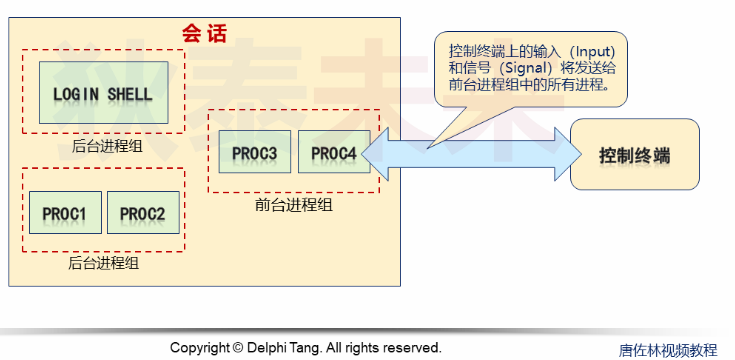

- [Linux进程层次分析](#linux进程层次分析)
  - [Linux进程组](#linux进程组)
  - [深入理解进程组](#深入理解进程组)
  - [Linux会话](#linux会话)


# Linux进程层次分析

## Linux进程组
1. 每个进程都有一个进程组号
   * 进程组: 一个或多个进程的集合
   * 进程组中的进程通常是父子关系, 兄弟关系或功能相近

2. 进程组可以方便进程管理(可以同时杀死多个进程, 发送一个信号到多个进程)
   * 每个进程一定属于一个进程组, 且只属于一个进程组
   * 有进程组ID
   * 进程组有一个进程组长, 进程ID和进程组ID一样

3. API
```C
#include <sys/types.h>
#include <unistd.h>

pid_t getpgid(pid_t pid);

pid_t getpgrp(void);                 /* POSIX.1 version */

int setpgid(pid_t pid, pid_t pgid);
// pid == pgid 指定pid为进程组长
// pid == 0    设置当前进程的组标识
// pgid == 0   将pid设置为设置为进程组长
```

## 深入理解进程组

* 进程组长终结, 依然存在进程组
* 如果需要修改子进程组ID则:
  * 父进程创建子进程后, 通过```setpgid()```修改子进程组标识
  * 子进程被创建后, 也通过```setpgid()```修改子进程组标识
    > 为什么?   
    > 因为你无法指定系统进程调度会把哪个进程,先被调度.  
    > 这种做法针对某些场景中,子进程被创建出来后需要马上进入新的进程组场景
* 子进程调用```exec()```, 父进程无法修改其组标识

## Linux会话

* 用户通过终端登录系统后产生一个会话
* 会话是一个或多个进程组的集合
* 每个会话都会有一个会话ID
  * 通常终端登录后, 第一个进程会成为会话首进程, 一般是 ```shell/bash```
  * 会话首进程的SID和PID相同
* 通常情况下, 会话都会与终端(控制终端)相关联,用作输入输出操作
  * 会话首进程与终端建立连接(**只有会话首进程能与终端连接**)
  * 会话的进程组分为
    * 前台进程组, 可以接收终端输入
    * 后台进程组, 只能向终端输出



终端进程组ID:  
* 用于标识进程是否处于一个和终端相关的标识
* 前台进程组: ```TPGID == PGID```
* 后台进程组: ```TPGID != PGID```
* 无终端关联 ```TPGID == -1```

```C
#include <sys/types.h>
#include <unistd.h>

#define _XOPEN_SOURCE  500
pid_t getsid(pid_t pid);

pid_t setsid(void);
```
* 创建新会话
* 创建新进程组
* 调用前管理了终端, 调用后与终端断联