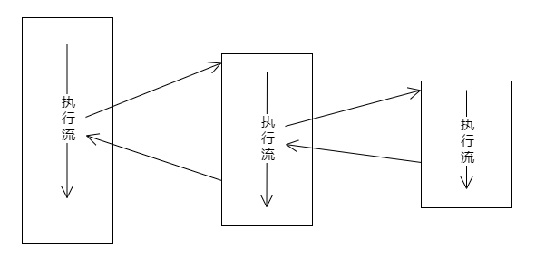

- [信号优先级与安全性](#信号优先级与安全性)
  - [问题](#问题)
  - [信号优先级概念](#信号优先级概念)
    - [实验设计](#实验设计)
  - [信号安全性](#信号安全性)
    - [再论信号处理](#再论信号处理)

# 信号优先级与安全性

## 问题

**对于同一个进程如果存在两个不同的未决信号, 那么优先处理谁**

## 信号优先级概念

* 信号本质是一种软中断 (中断有优先级, 信号也有) 
* 对于**同一未决的实时信号**, 按发送顺序执行
* 对于**不同的未决的实时信号**, <font color=red>**信号值越小**优先级越高</font>原则
* 不可靠信号与可靠信号同时未决
  * 严格意义上讲, 没有明确优先级
  * 在Linux中, 不可靠信号优先(**为什么**: 信号值越小优先级越高)
* 多个不可靠信号同时未决, 怎么发送
  * 优先发送硬件相关的信号
  * 值越小的不可靠信号
  * 不可靠信号**优先于**可靠信号

### 实验设计

目的: 验证信号优先级  
步骤: 发送N次无序的信号, 接收端接收打印

发送端:

```C
#define _POSIX_C_SOURCE 199309L
#define _XOPEN_SOURCE 600 

#include <signal.h>
#include <stdlib.h>
#include <stdio.h>
#include <time.h>

int filter(int* specials, int num, int sig)
{
    int ret = 0;

    for(int i = 0; i < num && !ret; i++)
    {
        ret = specials[i] == sig;
    }

    return ret;
}

int main(int argc, char* argv[])
{
    int sig = 0;
    int pid = atoi(argv[1]);
    int index = 0;
    int specials[] = {32, 33, SIGKILL};
    union sigval sv = {0};

    srand(time(NULL));

    for(int i = 0; i < 10; i++)
    {
        do{
            sig = rand() % 64 + 1;
        }while(filter(specials, sizeof(specials) / sizeof(*specials), sig));

        sv.sival_int = i;
        sigqueue(pid, sig, sv);

        printf("%d, %d\n", sig, sv.sival_int);
    }

    return 0;
}
```

接收端:

```C
#define _POSIX_C_SOURCE 199309L
#define _XOPEN_SOURCE 600 

#include <signal.h>
#include <stdlib.h>
#include <stdio.h>
#include <sys/types.h>
#include <unistd.h>

typedef struct 
{
    int sig;
    int index;
}siginfo;

static siginfo g_siginfos[90];
static int g_index = 0;

static void handler(int num, siginfo_t* info, void* context)
{
    g_siginfos[g_index].sig = info->si_signo;
    g_siginfos[g_index].index = info->si_int;
    g_index++;
}

int main()
{
    sigset_t set;
    int pid = getpid();
    struct sigaction sa;

    printf("pid: %d\n", pid);

    sa.sa_flags = SA_RESTART | SA_NODEFER | SA_SIGINFO;
    sa.sa_sigaction = handler;

    for(int i = 1; i <= 64; i++)
    {
        sigaddset(&sa.sa_mask, i);
    }

    for(int i = 1; i <= 64; i++)
    {
        sigaction(i, &sa, NULL);
    }

    sigfillset(&set);
    sigprocmask(SIG_SETMASK, &set, NULL);

    for(int i = 0; i < 15; i++)
    {
        printf("%d\n", i);
        sleep(1);
    }

    sigemptyset(&set);
    sigprocmask(SIG_SETMASK, &set, NULL);

    printf("==================\n");

    for(int i = 0; i < g_index; i++)
    {
        printf("%d: %d\n", g_siginfos[i].sig, g_siginfos[i].index);
    }


    return 0;
}
```

## 信号安全性

### 再论信号处理



> 信号抵达进程, 执行信号处理函数, 这个过程中改变的只是执行流, 不涉及上下文切换(多线程)

**什么是信号安全性**

* 程序能正确且无意外按照预期执行

**信号处理的不确定性**

* 什么时候抵达不确定, 程序被中断的位置不确定
  
  > 程序被中断的位置不确定 会有可能导致不确定的问题发送

**当信号抵达时, 在执行信号处理函数中, 不能调用不可重入函数**

> 不可重入函数: 函数不可被超过一根任务共享, 除非保证了互斥

### 实验代码

暂略

## 深入信号安全性

* 不要再信号处理函数中调用**不可重入函数**

* 不要调用调用函数中存在**临界区**的函数(可能产生死锁)

* 不要调用 ```malloc```/```free```
  
  > 根据 glibc 2.27版本中 malloc是使用了锁的

* 不要调用标准IO函数
  
  > 标准IO函数很有可能是使用全局变量的
  
   可以使用 ```man 7 signal-safety``` 查看哪些是可重入函数