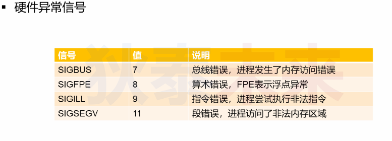
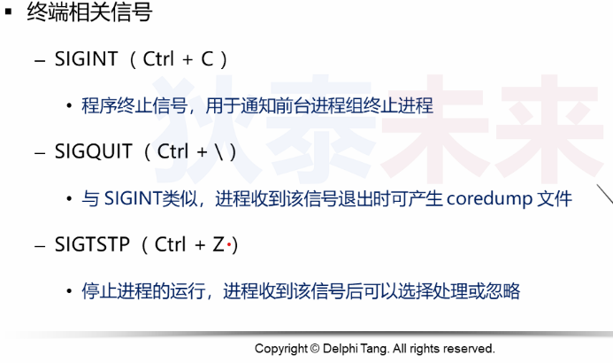
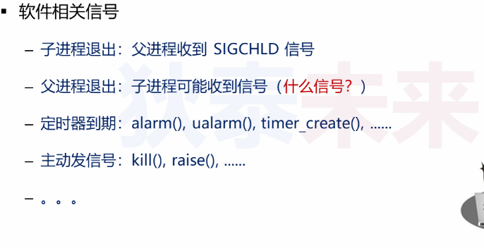
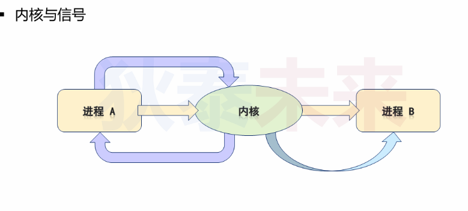
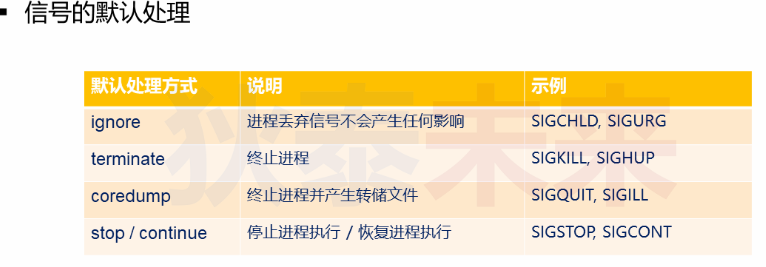
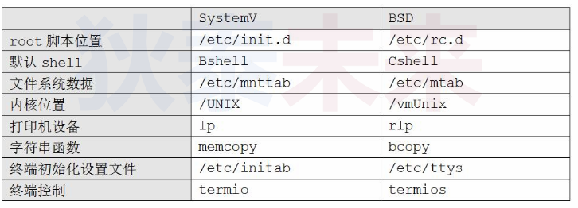
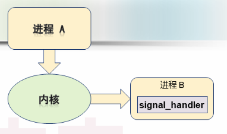
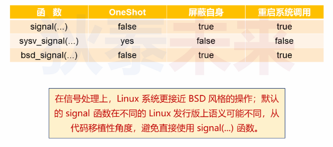

- [信号发生与处理](#信号发生与处理)
  - [信号](#信号)
  - [system V 与 BSD](#system-v-与-bsd)
  - [自定义发送信号](#自定义发送信号)
  - [自定义信号处理](#自定义信号处理)
    - [这三种函数有什么区别?](#这三种函数有什么区别)

# 信号发生与处理

## 信号

问题: 为什么按下 ```Ctrl + C```后命令行中的前台程序会被终止?

* 信号概念  
  
  * 信号是一种**软中断**, 用来处理异步事件
    * 内核发送信号到某个进程, 通知进程事件发生
    * 事件可能来自硬件, 用户输入或者除零异常等
  * 信号是一种进程间通信
    * 进程可以接收不同信号响应不同动作

* 信号分类
  
  * 硬件异常: 内核检测到硬件错误, 发生相应信号到相关进程
  * 终端信号: 在终端输入特定的字符, 等价于向进程发送对应信号
  * 软件信号: 在软件层触发信号, 发送给自身或者其他进程






上图中有几个箭头路径:

* A -> 内核 -> A :   
  代表A进程需要某个信号, 内核会在特定时刻发送信号到进程A

* A -> 内核 -> B:  
  进程A发送信号经过内核转发到进程B

* 内核 -> B:  
  内核如检测到异常会主动发送信号到指定进程



## system V 与 BSD

* system V: 被称为 AT&T System V, Unix分支之一
* BSD: 加州伯克利分校开创, Unix衍生系统

> Linux 是类Unix系统, 其风格介于上述两者之间



## 自定义发送信号

```C
#include <sys/types.h>
#include <signal.h>

int kill(pid_t pid, int sig);
// pid > 0:  发送信号到 进程号为pid的进程
// pid == 0: 发送信号到当前进程所在的进程组所有进程
// pid == -1:发送信号到所有有权限可以发送给的进程,除了自身和init进程 类似广播
// pid < -1: 发送信号给进程组号是 -pid的进程组中的所有进程

int raise(int sig);
```

* 标准unix系统的信号范围是 1-31
* 实时信号是Linux独有的,范围是 32-64



## 自定义信号处理

```C
#include <signal.h>

typedef void (*sighandler_t)(int);

sighandler_t signal(int signum, sighandler_t handler);

#define _XOPEN_SOURCE  500
sighandler_t bsd_signal(int signum, sighandler_t handler);

#define _GNU_SOURCE
sighandler_t sysv_signal(int signum, sighandler_t handler);
```

### 这三种函数有什么区别?

信号的三大特性:

* 信号的OneShot特性  
  
  * System V风格的```signal```函数, 注册的信号处理是一次性的
    * 进程收到信号后, 调用注册的处理函数
    * 处理函数一旦执行, **后续的信号都会被进程按照默认方式处理(不是调用处理函数)**
    * 如果想要重复处理, 就需要重复注册
      
      > BSD 风格的的signal函数不存在OneShot特性

* 信号自身屏蔽特性  
  信号处理期间, 有可能再次收到相同信号  
  
  * System V风格的signal函数会引起信号**重入**, 即处理过程中再次被打断触发处理函数
  * 在注册处理函数时  
    * system V不会屏蔽任何信号
    * BSD会屏蔽自身信号
      
      > BSDf风格的signal函数, 如果处理A信号期间又收到B信号, 会打断A信号处理处理B信号

* 系统调用重启特性
  
  * 系统调用期间, 可能收到信号, 那么系统调用必须返回
  * 对于长期调用 ```write/read```函数, 被信号终端可能性很大
  * 如果希望被打断后, 重新调用, 需要判断错误码 ```errno == EINTR```
  * SystemV风格的会被打断, BSD风格的打断会自动重启

```C
    while((ret = read(STDIN_FILENO, buf, sizeof(buf))== -1) && (errno == EINTR))
    {
        printf("restart syscall manuanlly\n");
    }
```

> 注意, 并非所有的系统调用都会支持自动重启, 具体需要翻阅手册

