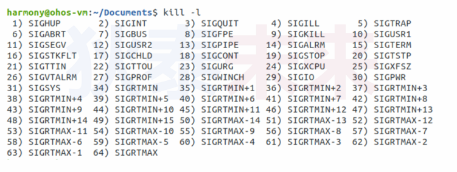

- [进程可靠性剖析](#进程可靠性剖析)
  - [剖析](#剖析)
  - [信号可靠信实验](#信号可靠信实验)
  - [基于信号的进程间通信实验](#基于信号的进程间通信实验)

# 进程可靠性剖析

## 剖析

问题: 基于进程的进程间通信方式可靠吗?



* 信号的分类
  
  * 不可靠信号(传统信号)
    * 信号值在[1, 31]区间的信号
  * 可靠信号(实时信号)
    * 信号值在[34, 64]区间的信号 

* 信号小知识
  
  * 信号**32(SIGCANCEL), 33(SIGEXITED)** 被POSIX多线程库使用了
  * 对于内核, 信号32是最小的可靠信号

* 不可靠信号和可靠信号的比较
  
  * 不可靠信号
    * 内核不保证信号都能传递到指定进程(内核对信号状态标记)
    * 如果信号处于[未决状态](现代信号处理.md), 并且有相同信号被发送, 内核会抛弃后续相同信号  
  * 可靠信号
    * 内核会维护信号队列, 未决信号处在队列中, 不会被丢弃
    * 严格意义上, 队列长度是有限的不能无限制保存未决信号

* 注意
  
  * 不可靠信号默认处理方式有可能是不一样的
  * 可靠信号的默认处理方式都是结束进程
  * 信号的可靠性是由**信号的值**决定的, 不是发送方式
  * 可以使用```ulimit -i 数量```调整信号队列长度

## 信号可靠信实验

接口说明

```C
#include <signal.h>

// 初始化集合全1
int sigfillset(sigset_t *set);

// 初始化集合全0
int sigemptyset(sigset_t *set);

// 添加一个信号到集合
int sigaddset(sigset_t *set, int signum);

// 删除一个信号到集合
int sigdelset(sigset_t *set, int signum);

// 针对信号集合做处理
// @param how: 
//             SIG_BLOCK:  添加信号集合作为信号掩码
//             SIG_UNBLOCK: 去掉指定信号集合指定的信号掩码
//             SIG_SETMASK: 设置传入的信号集合作为新的信号掩码
#define _POSIX_C_SOURCE 199309L
int sigprocmask(int how, const sigset_t *set, sigset_t *oldset);
```

```C
#define _POSIX_C_SOURCE 199309L
#define _XOPEN_SOURCE 600

#include <stdio.h>
#include <signal.h>
#include <unistd.h>

static int g_count;

void handler(int num, siginfo_t* info, void* user)
{
    g_count++;
}

int main(int argc, char* argv[])
{
    int i = 10;
    struct sigaction act = {0};
    sigset_t set;

    act.sa_sigaction = handler;
    act.sa_flags = SA_RESTART | SA_SIGINFO;

    sigaction(SIGUSR1, &act, NULL);  
    sigaction(40, &act, NULL);  


    sigfillset(&set);
    sigprocmask(SIG_BLOCK, &set, NULL);

    printf("pid:%d\n", getpid());

    while(i--)
    {
        sleep(1);
        printf("%d...\n", i);
    }

    sigfillset(&set);
    sigprocmask(SIG_UNBLOCK, &set, NULL);

    printf("count %d\n", g_count);

    return 0;
}
```

```C
#define _POSIX_C_SOURCE 199309L
#define _XOPEN_SOURCE 600 

#include <signal.h>
#include <stdlib.h>

int main(int argc, char* argv[])
{
    int ppid = atoi(argv[1]);
    int sig = atoi(argv[2]);
    int count = 2000;

    union sigval val = {0};

    while(count--)
    {
        sigqueue(ppid, sig, val);
    }

    return 0;
}
```

## 基于信号的进程间通信实验

* 已T-L-V格式协议进行通信

```C
#define _POSIX_C_SOURCE 199309L
#define _XOPEN_SOURCE 600

#include <stdio.h>
#include <signal.h>
#include <unistd.h>
#include <stdlib.h>
#include <string.h>

typedef struct
{
    short type;
    short length;
    char data[];
}Message;

int main(int argc, char* argv[])
{
    int pid = atoi(argv[1]);
    int sig = atoi(argv[2]);
    char* data = argv[3];

    int len = sizeof(Message) + strlen(data) + 1;
    int size = ((len / 4) + !!(len % 4)) * 4;

    Message* msg = (Message*)malloc(size);

    memset(msg, 0, len);

    msg->type = 0x11;
    msg->length = strlen(data);
    strcpy(msg->data, data);

    int* p = (int*)msg;

    for(int i = 0; i < size; i+=4)
    {
        union sigval info;

        info.sival_int = *p++;

        sigqueue(pid, sig, info);
    }

    return 0;
}
```

```C
#define _POSIX_C_SOURCE 199309L
#define _XOPEN_SOURCE 600

#include <stdio.h>
#include <signal.h>
#include <unistd.h>
#include <stdlib.h>

typedef struct
{
    short type;
    short length;
    char data[];
}Message;

static Message* g_msg;

static short g_index = -1;

void handler(int num, siginfo_t* info, void* user)
{
    if(g_index == -1)
    {
        int val = info->si_int;
        int type = val & 0xFFFF;
        int length = (val >> 16) & 0xFFFF;

        g_msg = (Message*)malloc(sizeof(Message) + length);
        g_msg->type = type;
        g_msg->length = length;

        g_index = 0;
    }
    else
    {
        int i = 0;
        int val = info->si_int;

        while((i < 4) && (g_index < g_msg->length))
        {

            g_msg->data[g_index] =  val & 0xFF;

            val = val >> 8;
            i++;
            g_index++;
        }

        if((g_index == g_msg->length) && (g_index != -1))
        {
            printf("type:%02x, length:%d, data:%s\n", g_msg->type, g_msg->length, g_msg->data);

            g_index = -1;
            free(g_msg);
        }
    }
}

int main(int argc, char* argv[])
{
    struct sigaction act;

    act.sa_flags = SA_RESTART | SA_SIGINFO;
    act.sa_sigaction = handler;

    sigemptyset(&act.sa_mask);

    sigaction(40, &act, NULL);

    printf("pid:%d\n", getpid());

    while(1) sleep(1);

    return 0;
}
```