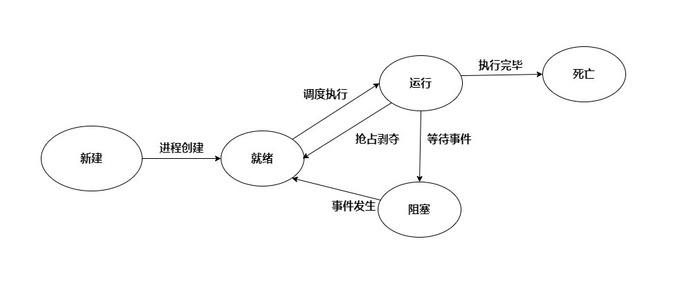
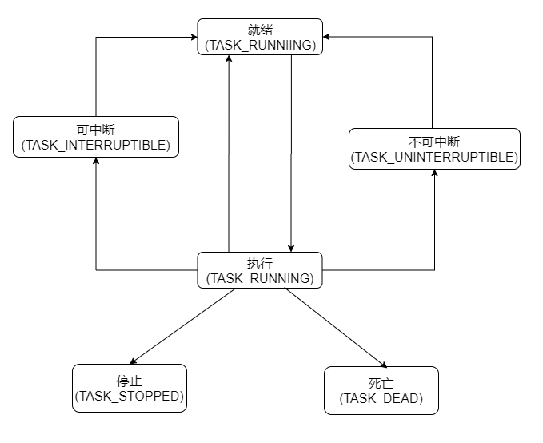

- [进程生命周期](#进程生命周期)
  - [Linux进程的基本概念](#linux进程的基本概念)
  - [Linux进程的生命周期](#linux进程的生命周期)
  - [Linux进程初识实践](#linux进程初识实践)


## 进程生命周期



> 进程是"活"的, 程序是"死"的, 程序不过是存储在硬盘的数据
* 要想程序发挥作用, 必须要让CPU执行程序文件里面的指令数据
* 要让程序加载执行, 就应该有个载体 --> 进程
* 进程 与 程序 不是一个必然的联系, 进程可以没有指令(不过这没有实际意义)

### Linux进程的基本概念

* 进程是Linux的执行单元, 
* 进程要执行任务, 就需要资源, 所以进程也是系统资源的分配单元
* 每个Linux程序运行后由一个或多个进程构成
* 每个Linux进程可以执行一个或多个程序
* Linux进程有多种不同状态

### Linux进程的生命周期


* 在阻塞状态下分为**可中断状态**和**不可中断状态**  
  为什么需要分两种状态呢?  
  1. 对于一些特定场合, 比如需要与高实时性的外设通信,那么就有可能  
     需要是在极短的时间内有回应或者发送数据, 此时该进程是不能被打断  
     只能一直等待发送/应答, 而如果在等待时候被打断那么就有可能错过  
     通信机会导致通信失败。  
   
### Linux进程初识实践

* 每个进程都会存在一个唯一的进程标识(PID)
* 每个进程都是由另外一个进程创建(父进程)

```C
  pid_t getpid();  获取当前进程PID

  pid_t getppid(); 获取父进程PID
```

问题:  
1. **Linux的第一个进程是什么**
  * Linux进程是以树状结构组成的
  * 树根是由内核自动创建即 IDLE(PID=0)进程创建
  * 系统中第一个进程是init/system进程(PID=1), 
    > 1号进程由IDLE进程创建, 负责完成系统内核部分初始化工作, 
    > 一号进程在加载执行初始化程序后, 演变为用户态的1号进程
  


1. **如何创建一个进程**

```C
pid_t fork();
```
* 为系统调用, 通过当前进程创建新进程, 当前进程为父进程, 新进程为子进程
* ```fork```为子进程申请内存空间, 将父进程的全部进程信息数据**复制**到子进程
* 两个进程中的程序执行位置一致, 为```fork```调用的位置
* 不同的是:   
  父进程```fork```返回 子进程PID  
  子进程```fork```返回 0  
  通过返回值可判断父子进程

```C
   #include <stdio.h>
   #include <unistd.h>
   #include <sys/types.h>
  
   int main()
   {
  
       printf("this is fork test\n");
       printf("current %d\n", getpid());
 
      if(fork() > 0)
      {
          printf("this is parent %d\n", getpid());
      }
      else
      {
          printf("this is child %d my parent is %d\n", getpid(), getppid());
      }
 
      return 0;
  }            
```


如何理解 **每个Linux进程都可以执行一个或多个程序**

进程是存在于内存中, 而进程想要有意义, 就需要指令数据, 而指令和数据都存在于程序文件中, 那么进程就会加载程序文件, 又加载其他程序文件

那么想要做到上述, 就需要```execve()```   

```C
int execve(const char* pathname, char* const argv[], char* const envp[]);
```
* 为系统调用,在当前进程中执行 ```pathname```指定的代码
* 将指定程序文件加载到当前进程空间
* 加载后, **将程序执行位置重置为入口地址**
* ```execve()```  只会重置,**不会创建新进程**

一般可以结合```fork```和```execve```使用在子进程执行新程序

```C
#include <stdio.h>
#include <unistd.h>    
#include <sys/types.h>


int CreateProcess(const char* path, char* const argv[])
{
	int ret = 0;

	if((ret = fork()) == 0)
	{
		execve(path, argv, NULL);
	}

	return ret;
}

int main()
{

	printf("this is fork test\n");
	printf("current %d\n", getpid());

	printf("child %d\n", CreateProcess("gtest.out", NULL));

	return 0;
}
```