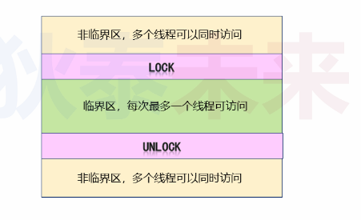
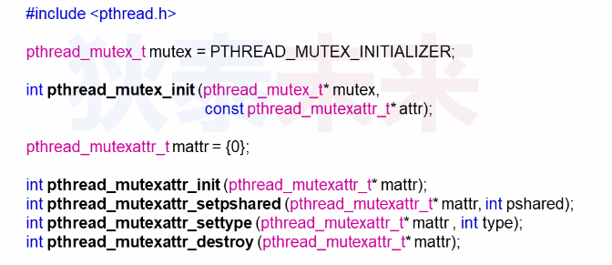
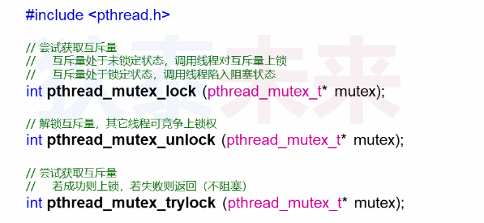
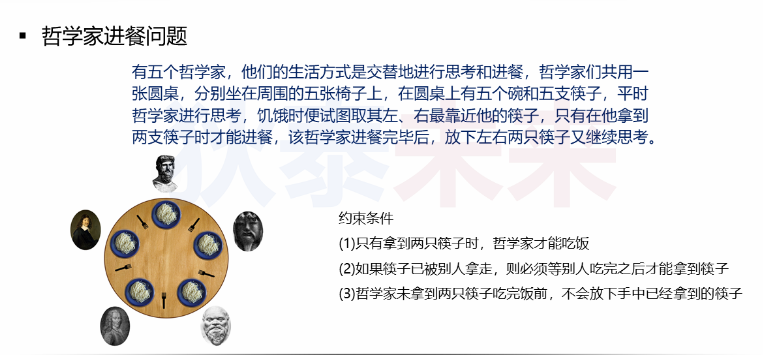

- [初识多线程互斥量](#初识多线程互斥量)
    - [问题：](#问题)
    - [临界区](#临界区)
    - [linux中的互斥量](#linux中的互斥量)
  - [哲学家就餐问题](#哲学家就餐问题)

# 初识多线程互斥量

### 问题：
多线程同时操作一个全局变量，会发生什么？

什么是原子操作？
* 这种操作一旦执行，除非执行完成，否则不能被打断
* 原子操作可以是一个执行步骤，也可以是多个步骤的集合
* 原子操作的顺序不能被打乱，也不能被切割只执行一部分
* 原子操作在多线程并发时，能保证操作结果正确性

思考：程序中的```i++```是原子操作吗

不是

* ```i++``` 会被解析成3步:

```C
mov ax, i
add ax, 1
mov i, ax
```
因此，```i++```不是原子操作

结论

* 应该避免多线程操作一个变量，
* 需求：需要保证操作原子性
  
### 临界区
  * 临界区是访问共享资源的代码片段（共享资源无法被多线程同时访问）
  * 临界区每次只能由一个线程访问
  * 当临界区被访问，其他线程只能等待（竞争）
  


### linux中的互斥量

互斥量，可以理解为保证临界区原子性，相当于一把锁




简单多线程例子

```C
#define _GNU_SOURCE     /* To get pthread_getattr_np() declaration */
#include <pthread.h>
#include <stdio.h>
#include <stdlib.h>
#include <unistd.h>
#include <memory.h>
#include <sys/syscall.h>

int g_count = 0;
pthread_mutex_t mutex = PTHREAD_MUTEX_INITIALIZER;

void* thread_entry(void* arg)
{  
    int i = 0;

    while( i < 10000 )
    {
        pthread_mutex_lock(&mutex);
            
        g_count++;
        
        pthread_mutex_unlock(&mutex);
        
        i++;
    }
    
    pthread_detach(pthread_self());
    
    return NULL;
}

int main()
{
    int r = 0;
    pthread_t t = 0;
    
    for(r=0; r<5; r++)
    {
        pthread_create(&t, NULL, thread_entry, NULL);
    }
    
    sleep(5);
    
    printf("g_count = %d\n", g_count);
    
    return 0;
}
```

## 哲学家就餐问题



```C
#define _GNU_SOURCE     /* To get pthread_getattr_np() declaration */
#include <pthread.h>
#include <stdio.h>
#include <stdlib.h>
#include <unistd.h>
#include <memory.h>
#include <sys/syscall.h>

#define N  5

static pthread_mutex_t g_chopsticks[N] = {0};

static void pick_up(int i)
{
    pthread_mutex_lock(&g_chopsticks[i]);
}

static void put_down(int i)
{
    pthread_mutex_unlock(&g_chopsticks[i]);
}

static void pick_up_left(int i)
{
    pick_up(i);
}

static void pick_up_right(int i)
{
    pick_up((i+1) % N);
}

static void put_down_left(int i)
{
    put_down(i);
}

static void put_down_right(int i)
{
    put_down((i+1)%N);
}

static void think(int i)
{
    printf("philosopher %d: thinking...\n", i);
    usleep(200 * 1000);
}

static void eat(int i)
{
    printf("philosopher %d: eating...\n", i);
    usleep(500 * 1000);
}

static void* philosopher(void* arg)
{  
    int i = (long)arg;

    while( 1 )
    {
        think(i);
        
        pick_up_left(i);
        pick_up_right(i);
        
        eat(i);
        
        put_down_right(i);
        put_down_left(i);
    }
    
    return NULL;
}

int main()
{
    int r = 0;
    pthread_t t = 0;
    
    for(r=0; r<N; r++)
    {
        pthread_create(&t, NULL, philosopher, (void*)(long)r);
    }
    
    while(1)
    {
        sleep(1);
    }
    
    return 0;
}
```