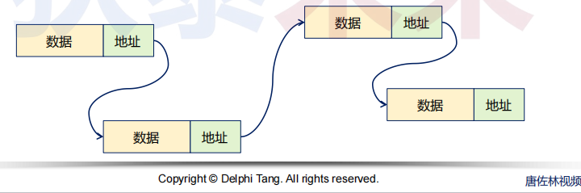
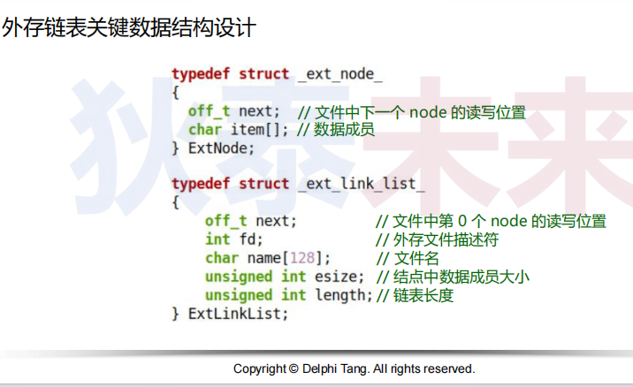
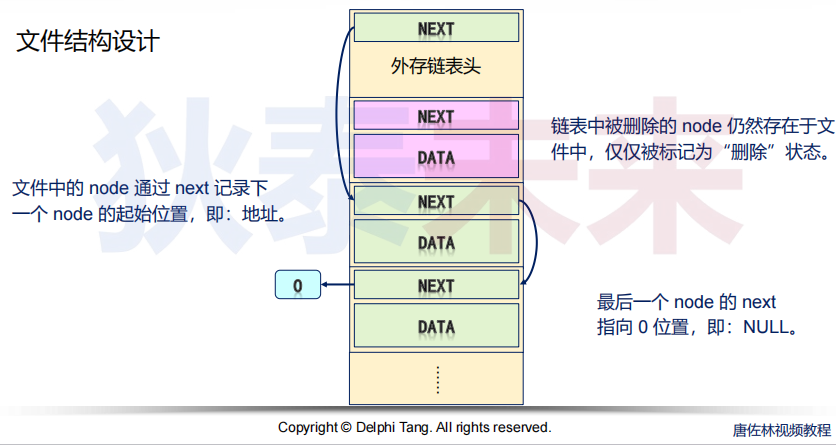
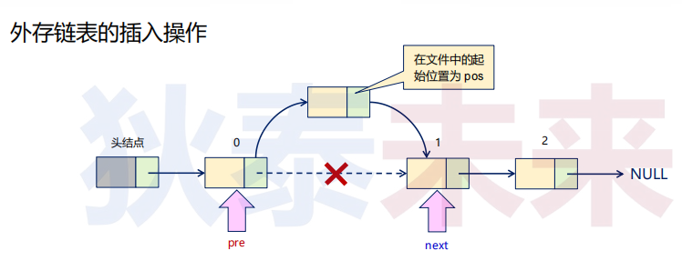
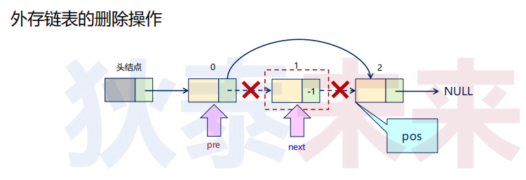

- [外存链表设计与实现](#外存链表设计与实现)
  - [链式存储结构](#链式存储结构)
  - [外存链表操作细节](#外存链表操作细节)


# 外存链表设计与实现

问题：文件中可以实现顺序存储的线性表，那么文件中是否可以实现链表？

## 链式存储结构

基于链式存储结构的线性表中，每个结点都包含数据域和指针域

* 数据域：存储数据元素本身
* 指针域：存储相邻结点的地址



问题：外存链表中“下一个节点地址”存储的是什么？
* **既然链表存储在文件中，那么对应的地址就是节点在文件中的偏移**




## 外存链表操作细节




* 定位到目标位置，即：```pre``` 之后 ```next``` 之前
* 从文件中读取 ```pre``` 结点，设置 ```next``` 为 ```pos```，并写回文件同一位置
* 将目标结点的 ```next``` 设置为 ```next``` ```pos``` 位置




* 定位到目标位置，即：```next``` 指向需要删除的结点
* 从文件中读取 ```next``` 结点，设置 ```next``` 为 -1，并写回文件同一位置
* 从文件中读取 ```pre``` 结点，设置 ```next``` 为 ```pos```，并写回文件同一位置


```C
#ifndef ELINKLIST_H
#define ELINKLIST_H

typedef void ELinkList;

#define ELinkList_Init(type)    _ELinkList_Init(sizeof(type))

#define ELinkList_Insert(list, index, element)({ \
    typeof(element) e = element;             \
    _ELinkList_Insert(list, index, (void*)&e);   \
}) 

#define ELinkList_Append(list, element)({        \
    typeof(element) e = element;             \
    ELinkList_Append(list, (void*)&e);          \
})

#define ELinkList_Set(list, index, element)({    \
    typeof(element) e = element;             \
    ELinkList_Set(list, index, (void*)&e);      \
})

int ELinkList_Remove(ELinkList* list, int index);
int ELinkList_Clear(ELinkList* list);
int ELinkList_Length(ELinkList* list);
int ELinkList_Get(ELinkList* list, int index, void* element);

ELinkList* _ELinkList_Init(int type_size);
int _ELinkList_Insert(ELinkList* list, int index, void* element);
int _ELinkList_Append(ELinkList* list, void* element);
int _ELinkList_Set(ELinkList* list, int index, void* element);


void ELinkList_Release(ELinkList* list);

#endif
```

```C
#define _XOPEN_SOURCE  500
#include <stdio.h>
#include <unistd.h>
#include <stdlib.h>
#include <fcntl.h>
#include <alloca.h>
#include <string.h>
#include <sys/types.h>
#include <sys/stat.h>
#include <sys/time.h>
#include "ELinklist.h"

#define LIST_NODE_SIZE (sizeof(ListHead))
#define LIST_HEAD_SIZE (sizeof(_ELinkList))

#define FREE_NODE (-1)
#define END_NODE  (0)

typedef struct
{
    unsigned int next;
    char data[0];
}ListHead;

typedef struct{
    int fd;
    int length;
    int type_size;
    char path[128];
    unsigned int next;
    //ListHead head;
}_ELinkList;

static int _ELinkList_GetFree(_ELinkList* list)
{
    int ret = 0;
    int next = 0;
    int offset = 0;
    ListHead* node = (ListHead*)alloca(list->type_size + LIST_NODE_SIZE);

    lseek(list->fd, LIST_HEAD_SIZE, SEEK_SET);

    while(node->next != FREE_NODE && ret > 0)
    {
        ret = read(list->fd, (void*)node, LIST_NODE_SIZE);

        offset = ret > 0 ? (offset + ret) : -1;
    }

    if(offset > 0)
    {
        ret = offset - (list->type_size + LIST_NODE_SIZE);
    }
    else
    {
        ret = lseek(list->fd, 0, SEEK_END);
    }


    return ret;
}

static int Get_At(_ELinkList* list, int pos, ListHead* node)
{
    int ret = -1;

    if(node && list && (lseek(list->fd, pos, SEEK_SET) == pos))
    {
        ret = (read(list->fd, node, LIST_NODE_SIZE + list->type_size) > 0) ? 0 : -1;
    }

    return ret;
}

static int Set_At(_ELinkList* list, int pos, ListHead* node)
{
    int ret = -1;

    if(node && list && (lseek(list->fd, pos, SEEK_SET) == pos))
    {
        ret = (write(list->fd, node, LIST_NODE_SIZE + list->type_size) != -1) ? 0 : -1;
    }

    return ret;   
}

static int _ElinkList_Get(_ELinkList* list, int index, ListHead* node)
{
    int ret = 0;
    int last = 0;
    int next = list->next;

    for(int i = 0; i <= index && (list->length > index); i++)
    {
        if(Get_At(list, next, node) == 0)
        {
            if(node->next != END_NODE)
            {
                last = next;
                next = node->next;
            }
        }
    }

    ret = last;

    return ret;
}

ELinkList* _ELinkList_Init(int type_size)
{
    struct timeval t = {0};
    _ELinkList* list = (_ELinkList*)calloc(1, LIST_HEAD_SIZE);

    gettimeofday(&t, NULL);

    sprintf(list->path, "%ld_%ld.tmp", t.tv_sec, t.tv_usec/1000);

    list->fd = open(list->path, O_CREAT | O_RDWR, S_IRUSR | S_IWUSR);
    list->type_size = type_size;
    list->next = END_NODE;
    list->length = 0;

    if(list->fd < 0)
    {
        free(list);
        list = NULL;
    }
    else
    {
        write(list->fd, (void*)list, LIST_HEAD_SIZE);
    }

    return list;
}

int _ELinkList_Insert(ELinkList* list, int index, void* element)
{
    int ret = 0;
    _ELinkList* l = (_ELinkList*)list;

    if(l && l->length >= index)
    {
        int pos = LIST_HEAD_SIZE;
        int free_pos = 0;
        int last = 0;
        int next = l->next;
        ListHead* prev = (ListHead*)alloca(l->type_size + LIST_NODE_SIZE);
        ListHead* node = (ListHead*)alloca(l->type_size + LIST_NODE_SIZE);
        
        free_pos = _ELinkList_GetFree(l);

        while(index > 0)
        {
            if(Get_At(list, next, prev) == 0)
            {
                last = next;
                next = prev->next;
            }
            else
            {
                break;
            }

            index--;
        }

        if(index == 0)
        {
            memcpy(node->data, element, l->type_size);
            
            if(l->length == 0)
            {
                node->next = l->next;
                l->next = lseek(l->fd, 0, SEEK_END);
            }
            else
            {
                node->next = prev->next;
                prev->next = free_pos;

                Set_At(l, last, prev);
            }

            printf("free pos %d\n", free_pos);

            Set_At(l, free_pos, node);
            
            l->length++;
            lseek(l->fd, 0, SEEK_SET);
            write(l->fd, (void*)l, LIST_HEAD_SIZE);
        }
    }
    else
    {
        ret = -1;
    }

    return ret;
}

int _ELinkList_Append(ELinkList* list, void* element)
{
    return list ? _ELinkList_Insert((_ELinkList*)list, ((_ELinkList*)list)->length-1, element) : -1;
}

int _ELinkList_Set(ELinkList* list, int index, void* element)
{
    int ret = 0;
    int pos = 0;
    _ELinkList* l = (_ELinkList*)list;

    if(l && l->length > index)
    {
        ListHead* node = (ListHead*)alloca(l->type_size + LIST_NODE_SIZE);

        if((pos = _ElinkList_Get(list, index, node)) != 0)
        {
            memcpy(node->data, element, l->type_size);

            Set_At(l, pos, node);
        }
        else
        {
            ret = -1;
        }
    }

    return ret;
}

int ELinkList_Get(ELinkList* list, int index, void* element)
{
    int ret = 0;

    _ELinkList* l = (_ELinkList*)list;

    if(l && l->length > index)
    {
        ListHead* node = (ListHead*)alloca(l->type_size + LIST_NODE_SIZE);

        if(_ElinkList_Get(list, index, node) != 0)
        {
            memcpy(element, node->data, l->type_size);
        }
    }

    return 0;
}

int ELinkList_Remove(ELinkList* list, int index)
{
    _ELinkList* l = (_ELinkList*)list;

    if(l && l->length > index)
    {
        int last = 0;
        int size = l->type_size + LIST_NODE_SIZE;
        ListHead* node = (ListHead*)alloca(size);
        ListHead* prev = (ListHead*)alloca(size);
        
        if((last = _ElinkList_Get(list, index, node)) != 0)
        {
            if(index-1 > 0)
            {
                l->next = node->next;
            }
            else
            {
                int pos = _ElinkList_Get(list, index-1, prev);

                prev->next = node->next;

                Set_At(l, pos, prev);
            }
            
            printf("remove %d\n", last);

            node->next = FREE_NODE;
            Set_At(l, last, node);

            l->length--;
            lseek(l->fd, 0, SEEK_SET);
            write(l->fd, (void*)l, LIST_HEAD_SIZE);
        }
    }
}

int ELinkList_Clear(ELinkList* list)
{
    int next = 0;
    _ELinkList* l = (_ELinkList*)list;

    if(l)
    {
        int size = l->type_size + LIST_NODE_SIZE;
        ListHead* node = (ListHead*)alloca(size);

        next = l->next;

        for(int i = 0; i < l->length; i++)
        {
            if(_ElinkList_Get(l, i, node) != 0)
            {
                next = node->next;
                node->next = FREE_NODE;
            }
        }
    }
}

int ELinkList_Length(ELinkList* list)
{
    return ((_ELinkList*)list) != NULL ? ((_ELinkList*)list)->length : 0;
}


void ELinkList_Release(ELinkList* list)
{
    _ELinkList* l = (_ELinkList*)list;

    if(l)
    {
        close(l->fd);
        unlink(l->path);
        free(l);
    }
}
```