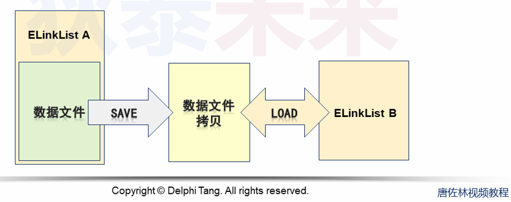
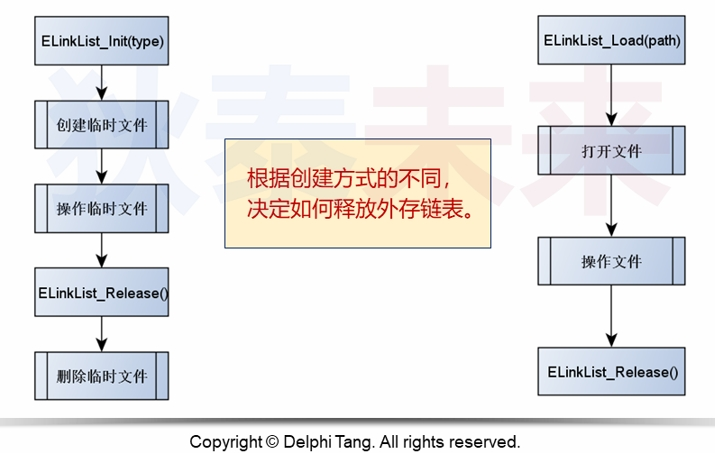
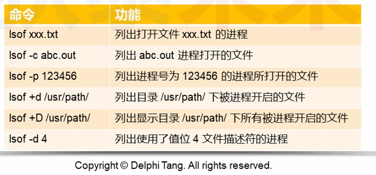

- [外存链表进阶与优化](#外存链表进阶与优化)
  - [问题](#问题)
    - [实现思路](#实现思路)
  - [思考](#思考)
    - [lsof 命令](#lsof-命令)


# 外存链表进阶与优化

## 问题

问题: 如何保存链表中的数据，并在下次程序运行时加载

### 实现思路

将链表保存在指定文件中，后续可通过读取文件中的数据创建链表



* 将外存链表在指定文件进行重新存储
* 增加新的外存链表创建方法


## 思考

* 从数据文件中创建的链表与直接初始化创建的链表的行为是否完全一致


一： 不完全相同


* 如果指定的文件与原文件同名，如何处理
> 针对同名文件，不做拷贝处理


* 如果一个数据文件被多次用来创建链表，如何处理  

一个数据文件只能被一个进程创建(如何保证?)

### lsof 命令

* 用于列出当前系统中已打开的文件
  


* 使用调用命令接口

```C
#include <stdio.h>
/* Create a new stream connected to a pipe running the given command.

   This function is a possible cancellation point and therefore not
   marked with __THROW.  */
extern FILE *popen (const char *__command, const char *__modes);


/* Close a stream opened by popen and return the status of its child.

   This function is a possible cancellation point and therefore not
   marked with __THROW.  */
extern int pclose (FILE *__stream);
```

优化后的代码如下  

```C
typedef struct _ext_link_list_
{
    off_t next;
    int fd;
    int del;// 对于已经进行保存到本地的list在release时不能被删除文件，对于list是读取本地文件的，在release一样不能被删除文件
    char name[128];
    unsigned int esize;
    unsigned int length;
} ExtLinkList;

static int is_used(const char* s)
{
    int ret = 0;
    
    if( access(s, F_OK) == 0 )
    {
        FILE* file = NULL;
        char buf[128] = {0};
        
        sprintf(buf, "lsof %s", s);
        
        file = popen(buf, "r");
        
        if( file )
        {
            int c = -1;
            int i = 0;
            
            while( (c = fgetc(file)) != -1 )
            {
                (s[i] == c) ? (i += 1) : (i = 0);
                
                if( s[i] == 0 )
                {
                    ret = 1;
                    break;
                }
            }
        }
        
        pclose(file);
    }
    
    return ret;
}

ELinkList* ELinkList_Load(const char* path)
{
    ExtLinkList* ret = path ? malloc(sizeof(ExtLinkList)) : NULL;
    
    if( ret )
    {
        int fd = !is_used(path) ? open(path, O_RDWR, 0777) : -1;
        
        if( (fd != -1) && (read(fd, ret, sizeof(*ret)) == sizeof(*ret)) )
        {
            ret->del = 0;
            ret->fd = fd;
            sprintf(ret->name, "%s", path);
        }
        else
        {
            close(ret->fd);
            free(ret);
            ret = NULL;
        }
    }
    
    return ret;
}

static int do_copy_file(int src_fd, const char* des)
{
    int ret = -1;
    char buf[256] = {0};
    int des_fd = -1;
    
    des_fd = open(des, O_CREAT | O_WRONLY, 0777);
    
    if( (src_fd != -1) && (des_fd != -1) )
    {
        do
        {
            ret = read(src_fd, buf, sizeof(buf));
            ret = (ret > 0) ? write(des_fd, buf, ret) : ret; 
        } while( ret == sizeof(buf) );
        
        close(des_fd);
        
        if( ret == -1 )
        {
            remove(des);
        }
    }
    
    return (ret >= 0) ? 0 : -1;
}

int ELinkList_Save(ELinkList* list, const char* path)
{
    int ret = -1;
    ExtLinkList* ea = list;
    
    if( ea && path )
    {
        int equal = !strcmp(ea->name, path);
        
        if( equal )
        {
            ea->del = 0;
        }
        
        ret = lseek(ea->fd, 0, SEEK_SET);
        ret += write(ea->fd, ea, sizeof(*ea));
        ret += lseek(ea->fd, 0, SEEK_SET);
        
        if( (ret == sizeof(*ea)) && !equal )
        {
            ret = do_copy_file(ea->fd, path);
        }
    }
    
    return ret;
}
```