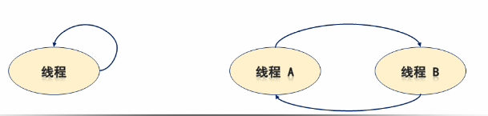
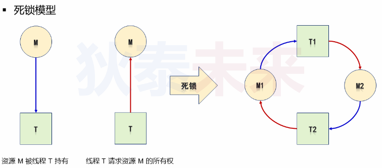
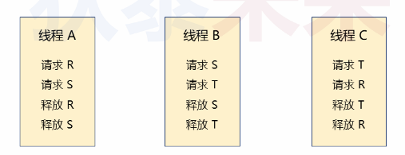

- [多线程与互斥量进阶](#多线程与互斥量进阶)
  - [不同类型的互斥量](#不同类型的互斥量)
  - [死锁](#死锁)
  - [互斥量类型设置](#互斥量类型设置)
  - [小结](#小结)
  - [死锁的四大条件](#死锁的四大条件)
  - [避免死锁经验](#避免死锁经验)

# 多线程与互斥量进阶

问题：一个线程多次尝试获取互斥量，会发生什么

如果不释放的话，会出现死锁

## 不同类型的互斥量


```C
  PTHREAD_MUTEX_NORMAL = PTHREAD_MUTEX_TIMED_NP,
  PTHREAD_MUTEX_RECURSIVE = PTHREAD_MUTEX_RECURSIVE_NP,
  PTHREAD_MUTEX_ERRORCHECK = PTHREAD_MUTEX_ERRORCHECK_NP,
  PTHREAD_MUTEX_DEFAULT = PTHREAD_MUTEX_NORMAL
```

## 死锁

* 等待关系：一个线程所需要的资源被其他线程占用，进而等待释放
* 线程之间出现循环互相等待


## 互斥量类型设置

```C
extern int pthread_mutexattr_init (pthread_mutexattr_t *__attr)
     __THROW __nonnull ((1));

/* Destroy mutex attribute object ATTR.  */
extern int pthread_mutexattr_destroy (pthread_mutexattr_t *__attr)
     __THROW __nonnull ((1));

#if defined __USE_UNIX98 || defined __USE_XOPEN2K8
/* Return in *KIND the mutex kind attribute in *ATTR.  */
extern int pthread_mutexattr_gettype (const pthread_mutexattr_t *__restrict
				      __attr, int *__restrict __kind)
     __THROW __nonnull ((1, 2));

/* Set the mutex kind attribute in *ATTR to KIND (either PTHREAD_MUTEX_NORMAL,
   PTHREAD_MUTEX_RECURSIVE, PTHREAD_MUTEX_ERRORCHECK, or
   PTHREAD_MUTEX_DEFAULT).  */
extern int pthread_mutexattr_settype (pthread_mutexattr_t *__attr, int __kind)
     __THROW __nonnull ((1));
```
## 小结

* ```PTHREAD_MUTEX_NORMAL```: 一旦上锁，任何线程再次尝试获取都会进入阻塞状态
* ```PTHREAD_MUTEX_RECURSIVE```: 同**一个线程**可以重复上锁,但是**需要相同次数释放锁**
* ```PTHREAD_MUTEX_ERRORCHECK```: 如果获取锁失败，之间返回错误

```C
#define _GNU_SOURCE     /* To get pthread_getattr_np() declaration */
#include <pthread.h>
#include <stdio.h>
#include <stdlib.h>
#include <unistd.h>
#include <memory.h>
#include <time.h>

void* thread_entry(void* arg)
{  
    pthread_mutex_t* pm = arg;
    
    sleep(1);
    
    pthread_mutex_lock(pm);

    printf("%s\n", __FUNCTION__);
        
    pthread_mutex_unlock(pm);
    
    pthread_detach(pthread_self());
    
    return NULL;
}

int main()
{
    int r = 0;
    pthread_t t;
    pthread_mutex_t mutex;
    pthread_mutexattr_t mattr;
    
    pthread_mutexattr_init(&mattr);
    
    pthread_mutexattr_settype(&mattr, PTHREAD_MUTEX_RECURSIVE);
    
    pthread_mutex_init(&mutex, &mattr);
    
    pthread_create(&t, NULL, thread_entry, &mutex);
    
    r = pthread_mutex_lock(&mutex);
    printf("r = %d\n", r);
    r = pthread_mutex_lock(&mutex);
    printf("r = %d\n", r);
    
    printf("Hello World!\n");
    
    pthread_mutex_unlock(&mutex);

    // 如果只有一次解锁，那么子线程将一直阻塞
    //pthread_mutex_unlock(&mutex);
    
    while( 1 )
    {
        sleep(1);
    }
    
    return 0;
}
```

## 死锁的四大条件

* **存在互斥关系**：多个线程想获取同一个资源
* **持有资源并还要获取资源**：线程需要获取多个互斥量才进入临界区
* **资源不可剥夺**：线程获取了互斥量但不释放给其他线程
* **循环等待关系**：多个线程互相等待形成环路

**如何避免死锁 ？？**

破环上述其中一个条件



## 避免死锁经验

* **按序获取**：多个互斥量，必须按顺序获取
* **设置超时**：超时未获取到互斥量，就返回
* 全局唯一互斥量(不推荐)

问题：  
假设三个线程A,B,C 和三个互斥量R,S,T，三个线程对三个互斥量请求和释放，
是否产生死锁？

答案：  
会出现

