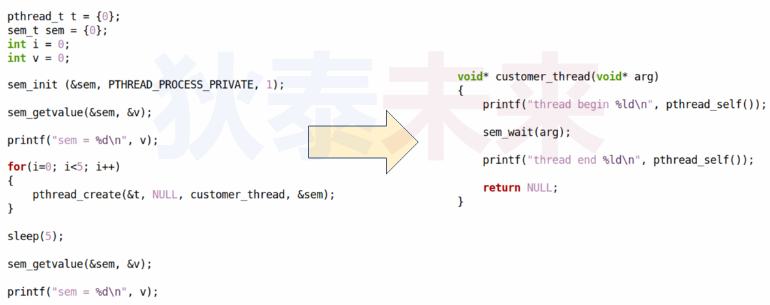
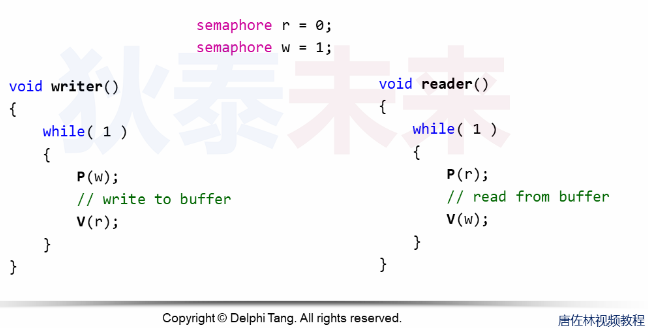

- [多线程与信号量简介](#多线程与信号量简介)
  - [信号量与PV操作](#信号量与pv操作)
  - [Linux中的信号量](#linux中的信号量)
  - [生产者消费者问题示例](#生产者消费者问题示例)
  - [多进程场景](#多进程场景)
    - [多进程内存共享](#多进程内存共享)
    - [多进程信号量](#多进程信号量)
  - [Linux信号量注意事项](#linux信号量注意事项)


# 多线程与信号量简介


由荷兰计算机科学家Dijkstra提出，旨在保护共享资源与同步任务  
背景：
* 1962年，设计与实现具有多到程序运行能力的操作系统
* 提出**任务状态**概念：**就绪**，**运行**，**阻塞**
* 设计思路：复用火车运行系统中，信号灯的概念

## 信号量与PV操作
* 计算机中信号量本质是整数，数值表示可用资源数量
* P操作（passeren-> 通过， 原子操作）
  * 如果 信号量 == 0，当前任务阻塞，
  * 如果 信号量 > 0，则：信号量数值-1，当前任务继续执行
* V操作（vrijgeven-> 释放，原子操作）
  * 将信号量-1
  * 若信号量 > 0，则唤醒阻塞进程，当前任务继续执行

信号量与PV操作注意事项

* 程序中PV操作必须成对出现
* 信号量初始值与相应资源数量相关
* 信号量可以看作特殊的互斥锁，（当信号量初始值为1时，可看作退化为互斥锁）
* 信号量 == S && S > 0，可进行P操作且不阻塞次数为S

## Linux中的信号量

```C
#include <semaphore.h>

/* Initialize semaphore object SEM to VALUE.  If PSHARED then share it
   with other processes.  */
extern int sem_init (sem_t *__sem, int __pshared, unsigned int __value)
     __THROW;
/* Free resources associated with semaphore object SEM.  */
extern int sem_destroy (sem_t *__sem) __THROW;

/* Wait for SEM being posted.

   This function is a cancellation point and therefore not marked with
   __THROW.  */
extern int sem_wait (sem_t *__sem);

#ifdef __USE_XOPEN2K
/* Similar to `sem_wait' but wait only until ABSTIME.

   This function is a cancellation point and therefore not marked with
   __THROW.  */
extern int sem_timedwait (sem_t *__restrict __sem,
			  const struct timespec *__restrict __abstime);
#endif

/* Test whether SEM is posted.  */
extern int sem_trywait (sem_t *__sem) __THROWNL;

/* Post SEM.  */
extern int sem_post (sem_t *__sem) __THROWNL;

/* Get current value of SEM and store it in *SVAL.  */
extern int sem_getvalue (sem_t *__restrict __sem, int *__restrict __sval)
     __THROW;
```

下面出现输出什么，为什么



>只有一个线程走完，其余线程阻塞， 因为，信号量初始值为1，其中一个线程做了V操作后，后面的其他线程，执行V操作时，会进入等待状态


## 生产者消费者问题示例


**思考：进程之间是否需要同步与互斥**

## 多进程场景
* 多进程共享同一段内存（共享内存）
* 此时，共享内存就是临界区
* 因此需要对临界区进行保护
* 是否存在跨进程互斥量？

### 多进程内存共享
```C
#include <sys/ipc.h>
#include <sys/shm.h>
#include <sys/types.h>

extern key_t ftok (const char *__pathname, int __proj_id) __THROW;

/* Shared memory control operation.  */
extern int shmctl (int __shmid, int __cmd, struct shmid_ds *__buf) __THROW;

/* Get shared memory segment.  */
extern int shmget (key_t __key, size_t __size, int __shmflg) __THROW;

/* Attach shared memory segment.  */
extern void *shmat (int __shmid, const void *__shmaddr, int __shmflg)
     __THROW;

/* Detach shared memory segment.  */
extern int shmdt (const void *__shmaddr) __THROW;

```

### 多进程信号量

```C
/* Open a named semaphore NAME with open flags OFLAG.  */
extern sem_t *sem_open (const char *__name, int __oflag, ...) __THROW;

/* Close descriptor for named semaphore SEM.  */
extern int sem_close (sem_t *__sem) __THROW;

/* Remove named semaphore NAME.  */
extern int sem_unlink (const char *__name) __THROW;
```


多进程读写共享内存示例
```C
#include <stdio.h>
#include <unistd.h>
#include <string.h>
#include <sys/ipc.h>
#include <sys/shm.h>
#include <sys/types.h>
#include <sys/stat.h>
#include <fcntl.h>
#include <semaphore.h>
#include <pthread.h>

#define SEM_W "zrb_w"
#define SEM_R "zrb_r"

int get_shm_mem(key_t key, int size)
{
    int id = 0;

    id = shmget(key, 0, 0);

    if(id == -1)
    {
        id = shmget(key, size, IPC_CREAT | IPC_EXCL | S_IRWXU);
    }

    return id;
} 

sem_t* get_sem(const char* name, int v)
{
    sem_t* sem = NULL;

    sem = sem_open(name, 0);

    if(sem == SEM_FAILED)
    {
        sem = sem_open(name, O_CREAT | O_EXCL, S_IRWXU, v);
    }

    return sem;
}

void writer(sem_t* sem_w, sem_t* sem_r, void* addr, int cnt)
{
    char buf[64] = {0};

    while(cnt--)
    {
        sem_wait(sem_w);

        sprintf(buf, "this is orland %d\n", cnt);

        memcpy(addr, buf, strlen(buf));

        printf("write: %s\n", buf);

        sem_post(sem_r);

        usleep(1000*1000);
    }
}

void reader(sem_t* sem_w, sem_t* sem_r, void* addr, int cnt)
{
char buf[64] = {0};

    while(cnt--)
    {
        sem_wait(sem_r);

        memcpy(buf, addr, sizeof(buf));

        printf("read: %s\b", buf);

        sem_post(sem_w);
    }
}

int main(int argc, char* argv[])
{
    int id;
    sem_t* sem_w;
    sem_t* sem_r;
    void* addr = NULL;
    key_t key = ftok("./", 1);

    if(key > 0)
    {
        sem_w = get_sem(SEM_W, 1);
        sem_r = get_sem(SEM_R, 0);

        id = get_shm_mem(key, 128);

        addr = shmat(id, NULL, 0);

        if(addr)
        {
            if(strcmp(argv[1], "w") == 0)
            {
                writer(sem_w, sem_r, addr, 10);
            }
            else if(strcmp(argv[1], "r") == 0)
            {
                reader(sem_w, sem_r, addr, 10);
            }
        }
        else
        {
            printf("addr err\n");
        }

        sem_close(sem_w);
        sem_close(sem_r);

        sem_unlink(SEM_W);
        sem_unlink(SEM_R);

        shmctl(id, IPC_RMID, NULL);
    }

    return 0;
}
```

## Linux信号量注意事项

* 信号量之间不能互相初始化以及赋值（行为未定义）
* 跨进程信号量通过文件形式，因此设计读写权限
* ```sem_close()```只是关闭信号量，并不删除信号量
* ```sem_unlink()```删除信号量（只有所有使用信号量的线程都关闭信号量后才会删除）