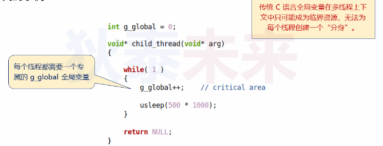
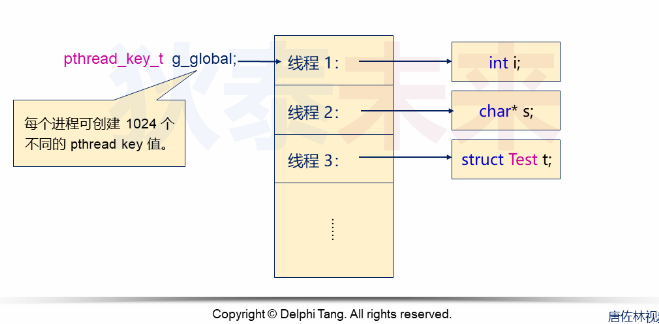

- [多线程局部存储技术](#多线程局部存储技术)
  - [可能的解决方案之一：](#可能的解决方案之一)
  - [NPTL解决方案](#nptl解决方案)
    - [NPTL解决方案的原理](#nptl解决方案的原理)
  - [GCC解决方案](#gcc解决方案)


# 多线程局部存储技术

问题：多线程上下文中，每个线程使用一个专属的全局变量，怎么做？



## 可能的解决方案之一：

```C
#define _GNU_SOURCE     /* To get pthread_getattr_np() declaration */
#define _XOPEN_SOURCE >= 500 || _POSIX_C_SOURCE >= 200809L
#include <pthread.h>
#include <stdio.h>
#include <stdlib.h>
#include <unistd.h>
#include <memory.h>
#include <semaphore.h>

#define g_value (global->value)
#define g_fl    (global->fl)
#define g_str   (global->str)

#define func1(i, j)      func1_(global, i, j)
#define func2(s)         func2_(global, s)
#define more_func_call() more_func_call_(global)

typedef struct
{
    int value;
    float fl;
    char* str;
} ThreadGlobal;

void func1_(ThreadGlobal* global, int i, int j)
{
    g_fl = 1.0 * i / j;
}

void func2_(ThreadGlobal* global, char* s)
{
    g_str = s;
}

void more_func_call_(ThreadGlobal* global)
{
    printf("g_value = %u\n", g_value);
    printf("g_fl = %f\n", g_fl);
    printf("g_str = %s\n", g_str);
}

void* child_thread(void* arg)
{   
    ThreadGlobal* global = arg;
    
    /* global variable initialization */
    g_value = pthread_self();
    g_fl = 0;
    g_str = "Delphi Tang";
    
    /* function call */
    func1(1, rand() % 10);
    func2("Test");
    
    more_func_call();
       
    return NULL;
}

int main()
{
    pthread_t t = {0};
    int i = 0;
    
    for(i=0; i<5; i++)
    {
        pthread_create(&t, 
                       NULL, 
                       child_thread, 
                       malloc(sizeof(ThreadGlobal)));
    }
    sleep(3);
    return 0;
}
```

> 仔细分析，当前这个方案，线程上下文调用的每个函数都必须包含"全局变量"的指针，使用起来很复杂

## NPTL解决方案

```C
/* Functions for handling thread-specific data.  */

/* Create a key value identifying a location in the thread-specific
   data area.  Each thread maintains a distinct thread-specific data
   area.  DESTR_FUNCTION, if non-NULL, is called with the value
   associated to that key when the key is destroyed.
   DESTR_FUNCTION is not called if the value associated is NULL when
   the key is destroyed.  */
extern int pthread_key_create (pthread_key_t *__key,
			       void (*__destr_function) (void *))
     __THROW __nonnull ((1));

/* Destroy KEY.  */
extern int pthread_key_delete (pthread_key_t __key) __THROW;

/* Return current value of the thread-specific data slot identified by KEY.  */
extern void *pthread_getspecific (pthread_key_t __key) __THROW;

/* Store POINTER in the thread-specific data slot identified by KEY. */
extern int pthread_setspecific (pthread_key_t __key,
				const void *__pointer) __THROW ;
```

不难看出，NPTL每次想对"全局变量"赋值或读取，都要调用对应函数，使用起来很复杂，可读性也不高。

### NPTL解决方案的原理



深度思考：
* NPTL方案可否自动交由**编译器**帮我们完成
* 传统C语言全局变量能否可扩展多份拷贝
* 如何区分传统全局变量和扩展全局变量
* 什么时候使用扩展的全局变量

## GCC解决方案

* ```__thread```关键字
* 被```__thread```修饰的变量，每个线程都会有该变量的拷贝
* 如果使用了```static```或```extern```，那么```__thread```位于其后
* ```__thread```变量可在声明进行初始化，也可以使用```&```操作符获取地址

```C
#define _GNU_SOURCE     /* To get pthread_getattr_np() declaration */
#define _XOPEN_SOURCE >= 500 || _POSIX_C_SOURCE >= 200809L
#include <pthread.h>
#include <stdio.h>
#include <stdlib.h>
#include <unistd.h>
#include <memory.h>
#include <semaphore.h>

static __thread long long g_global;

void func_1()
{
    printf("v = %lld\n", g_global);
}

void* thread_1(void* arg)
{   
    g_global = 255;  // set thread local global
    
    printf("thread_1 : &g_global = %p\n", &g_global);
    
    func_1(); // call to access local global
       
    return NULL;
}


void func_2()
{
    printf("s = %s\n", (char*)g_global);
}

void* thread_2(void* arg)
{   
    g_global = (long long)malloc(16);
    
    // set thread local global
    strcpy((char*)g_global, "Delphi Tang"); 
    
    printf("thread_2 : &g_global = %p\n", &g_global);

    func_2(); // call to access local global
       
    return NULL;
}

/*
void thread_delete(void* key)
{
    printf("key = %p\n", key);
    
    free(key);
}
*/

int main()
{
    pthread_t t1 = {0};
    pthread_t t2 = {0};
    
    // pthread_key_create(&g_thread_global, thread_delete);

    pthread_create(&t1, NULL, thread_1, NULL);
    pthread_create(&t2, NULL, thread_2, NULL);

    pthread_join(t1, NULL);
    pthread_join(t2, NULL);
    
    // pthread_key_delete(g_thread_global);
  
    return 0;
}

```