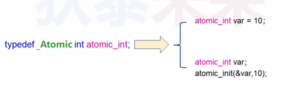
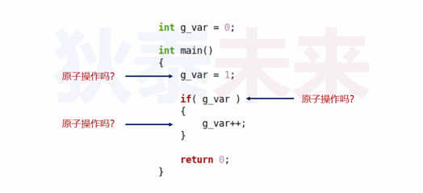
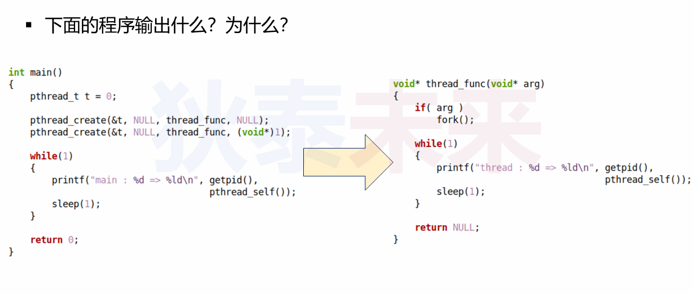
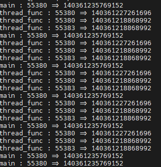
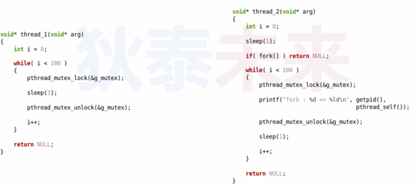
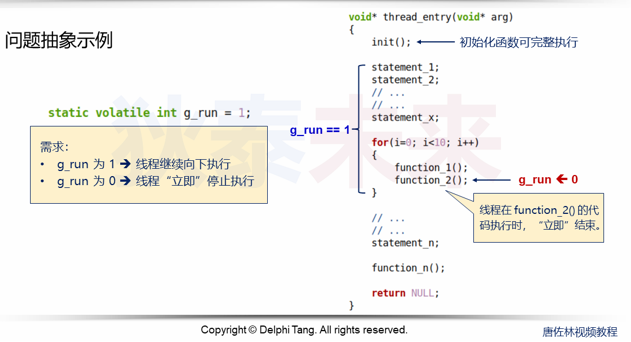

- [多线程编程杂谈](#多线程编程杂谈)
  - [问题需求](#问题需求)
    - [关键：](#关键)
    - [现代C语言原子化特性](#现代c语言原子化特性)
    - [思考](#思考)
  - [解决方案](#解决方案)
  - [Linux下的解决方案](#linux下的解决方案)
  - [信号与线程](#信号与线程)
    - [思考](#思考-1)


# 多线程编程杂谈

## 问题需求

问题: 线程执行过程中可以强制退出吗？主动还是被动？

问题抽象:   


需要解决的问题：
* ```g_run```全局变量需要保护吗
* 如何编码使得线程中每行代码都被```g_run```控制
* 线程代码被```g_run```控制:
  * 如何指定线程返回值
  * 如何回收资源

### 关键：
如何实现```g_run```原子化

以下是原子操作吗？
* ```g_run = 1``` (是)
* ```if(g_run)``` (是)
* ```while(g_run)``` (是)
* ```g_run++ , g_run-- ...``` (不是)


### 现代C语言原子化特性

* ```_Atomic``` 是关键字，被修饰的变量具有原子性
* ```_Atomic, const, volatile``` 都是同类型关键字




### 思考

 ```_Atomic```是现代C语言关键字，如果不使用，```int```类型变量操作还是原子吗



反汇编看看：

```
main:
.LFB0:
        .cfi_startproc
        pushq   %rbp
        .cfi_def_cfa_offset 16
        .cfi_offset 6, -16
        movq    %rsp, %rbp
        .cfi_def_cfa_register 6
        movl    $1, g_var(%rip)
        movl    g_var(%rip), %eax
        testl   %eax, %eax
        je      .L2
        movl    g_var(%rip), %eax
        addl    $1, %eax
        movl    %eax, g_var(%rip)
.L2:
        movl    $0, %eax
        popq    %rbp
        .cfi_def_cfa 7, 8
        ret
        .cfi_endproc
.LFE0:
        .size   main, .-main
        .ident  "GCC: (Ubuntu 7.5.0-3ubuntu1~18.04) 7.5.0"
        .section        .note.GNU-stack,"",@progbits
```

这里
* ```g_var = 1``` 
==>
```
movl    $1, g_var(%rip)
```

* ```if(g_var)``` ==>

```
movl    g_var(%rip), %eax
testl   %eax, %eax
je      .L2
```

* ```g_var++```
==>
```
movl    g_var(%rip), %eax
addl    $1, %eax
movl    %eax, g_var(%rip)
```

结论：
* 对于全局变量，赋值操作是原子
* 基于值的判断， 是原子操作
* 递增/递减不是原子操作

所以对```int```的值判断条件可以控制线程退出

## 解决方案

```C
#define R(code, ...)    ({                   \
    if( !g_run )                             \
        pthread_exit((NULL, ##__VA_ARGS__)); \
                                             \
    code;                                    \
})

void cleanup_handler(void* arg)
{
    printf("%s : %p\n", __FUNCTION__, arg);
    free(arg);
}

void* thread_func(void* arg)
{  
    int i = 0;
    char* pc = malloc(16);
    
    if( pc )
    {
        pthread_cleanup_push(cleanup_handler, pc);
        
        R(strcpy(pc, "Hello World!"), (void*)111);
        R(printf("%s\n", pc));
        
        for(i=0; i<10000; i++)
        {
            R(g_var++);
        }
        
        pthread_cleanup_pop(1);
    }
    
    return NULL;
}
```

注意事项：
* 不是每行代码都需要用```R()```控制
* 实践中 通常以代码块为粒度进行控制退出
* 临界区不能进行退出控制(导致死锁)

这个解决方案看起来还不是十分好，是否有更好的方法？

## Linux下的解决方案

Linux提供了线程取消函数

```C
/* Functions for handling cancellation.

   Note that these functions are explicitly not marked to not throw an
   exception in C++ code.  If cancellation is implemented by unwinding
   this is necessary to have the compiler generate the unwind information.  */

/* Set cancelability state of current thread to STATE, returning old
   state in *OLDSTATE if OLDSTATE is not NULL.  */
extern int pthread_setcancelstate (int __state, int *__oldstate);

/* Set cancellation state of current thread to TYPE, returning the old
   type in *OLDTYPE if OLDTYPE is not NULL.  */
extern int pthread_setcanceltype (int __type, int *__oldtype);

/* Cancel THREAD immediately or at the next possibility.  */
extern int pthread_cancel (pthread_t __th);

/* Test for pending cancellation for the current thread and terminate
   the thread as per pthread_exit(PTHREAD_CANCELED) if it has been
   cancelled.  */
extern void pthread_testcancel (void);
```

取消状态：
* ```PTHREAD_CANCEL_ENABLE``` 接受取消请求
* ```PTHREAD_CANCEL_DISABLE```拒绝取消请求

取消类型：
* 延迟取消：```PTHREAD_CANCEL_DEFERRED``` 线程继续执行，并会在下一个取消点退出
* 异步取消：```PTHREAD_CANCEL_ASYNCHRONOUS``` 可能会在任意一个位置退出

什么是取消点？

取消点就是特殊函数调用点：
* 线程允许取消并且类型是延迟取消
* 当接收到取消请求后，会在取消点中执行退出操作
* 一般用```pthread_testcancel```作为取消点
> sleep 等让线程进入等待状态的操作都可以是取消点

注意事项：  
**不要使用异步取消**

## 信号与线程

* 信号是进程层面的概念，进程内的所有线程都可以处理信号
* 进程收到信号后，任意挑选线程进行处理(未屏蔽目标信号)
* 可针对进程特定线程发送信号,此时只有目标线程收到信号
* 线程可以独立设置掩码

```C
/* Modify the signal mask for the calling thread.  The arguments have
   the same meaning as for sigprocmask(2). */
extern int pthread_sigmask (int __how,
			    const __sigset_t *__restrict __newmask,
			    __sigset_t *__restrict __oldmask)__THROW;

/* Send signal SIGNO to the given thread. */
extern int pthread_kill (pthread_t __threadid, int __signo) __THROW;

#ifdef __USE_GNU
/* Queue signal and data to a thread.  */
extern int pthread_sigqueue (pthread_t __threadid, int __signo,
			     const union sigval __value) __THROW;
#endif
```

注意事项：
* 父线程中的信号屏蔽会传递到子线程
* 发送给进程的信号首选主线程处理
* 若主线程屏蔽信号则选其他未屏蔽信号线程处理
* 线程注册的信号处理函数全局有效

**重要提醒：在多线程编程中，使用信号的第一原则是不要使用信号！！**

```C
#define _GNU_SOURCE     /* To get pthread_getattr_np() declaration */
#define _XOPEN_SOURCE >= 500 || _POSIX_C_SOURCE >= 200809L
#include <pthread.h>
#include <stdio.h>
#include <stdlib.h>
#include <unistd.h>
#include <signal.h>
#include <memory.h>
#include <semaphore.h>

static void mask_all_signal()
{
    sigset_t set = {0};
    
    sigfillset(&set);
    pthread_sigmask(SIG_SETMASK, &set, NULL);
}

void signal_handler(int sig, siginfo_t* info, void* ucontext)
{
    printf("handler : thread = %ld\n", pthread_self());
    printf("handler : sig = %d\n", sig);
    printf("handler : info->si_signo = %d\n", info->si_signo);
    printf("handler : info->si_code = %d\n", info->si_code);
    printf("handler : info->si_pid = %d\n", info->si_pid);
    printf("handler : info->si_value = %d\n", info->si_value.sival_int);
    
}

static void* thread_entry(const char* name, int sig, void* arg)
{
    struct sigaction act = {0};
    
    act.sa_sigaction = signal_handler;
    act.sa_flags = SA_SIGINFO;
    
    sigaddset(&act.sa_mask, sig);
    
    sigaction(sig, &act, NULL);
    
    while( 1 )
    {
        printf("%s ==> %ld : run...\n", name, pthread_self());
        sleep(1);
    }
       
    return NULL;
}

void* thread_func(void* arg)
{   
    return thread_entry(__FUNCTION__, 40, arg);
}

void* thread_exit(void* arg)
{   
    return thread_entry(__FUNCTION__, SIGINT, arg);
}

int main()
{
    pthread_t tf = 0;
    pthread_t te = 0;
    void* ret = NULL;
    union sigval sv = {1234567};
    
    printf("thread %ld : run...\n", pthread_self());
    
    pthread_create(&tf, NULL, thread_func, NULL);
    
    // mask_all_signal();
    
    pthread_create(&te, NULL, thread_exit, NULL);
    
    sleep(3);
    
    pthread_sigqueue(tf, 40, sv);
    
    sleep(3);
    
    pthread_kill(te, SIGINT);
    
    pthread_join(tf, &ret);
    pthread_join(te, &ret);

    return 0;
}

```

### 思考
主线程创建子线程，在子线程中调用```fork()```会发生什么？




原因：
* ```fork()```是针对进程复制的系统调用
* Linux中线程就是轻量级进程(fork 只会复制当前进程)
* 所以```fork()```:
  * 整个进程资源会被复制
  * 当前线程会被复制(寄存器值，执行流)
  * 其他线程不会复制

注意：
**多线程中进行```fork()```可能会出现死锁！！**


> 因为```fork()```会复制所有资源，包括互斥锁资源，
> 由于在临界区内进行```fork()```，此时互斥锁是上锁状态
> 所以fork出来的进程此时互斥锁也是上锁状态，就会出现死锁