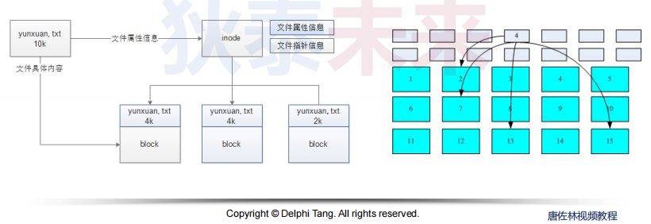
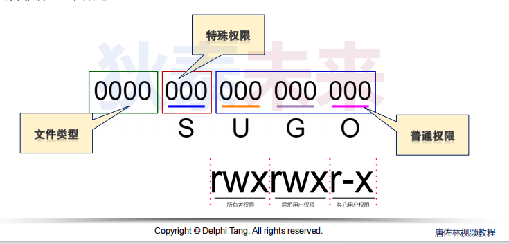
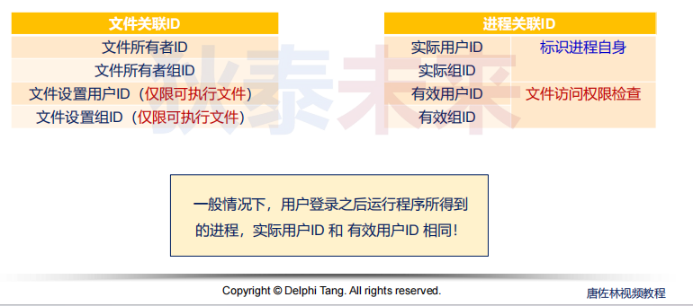

- [属性编程与权限编程]

# 属性编程与权限编程

问题 : 如何获取文件的大小，时间戳以及类型等信息？

## 再论inode

* 硬盘最小单位：扇区（512 字节）。

* 文件系统管理单位：块（通常为 8 个扇区）。

* 文件元信息：存储在 ```inode``` 中。

  * 每个文件都有一个唯一的inode，inode包含了文件的以下信息：

  * inode 是索引节点，文件系统将硬盘分为 索引节点区 和 文件数据区。
  
  * 每个文件必须占用一个 inode，且至少占用一个块。

  * 文件 = 文件属性 + 文件内容（通过 inode 编号关联）。

> 可以看到一个扇区512字节，8个扇区，所以文件系统管理块通常大小是一页(4k)



### 获取文件元信息

```C
struct stat {
    dev_t st_dev;       // 设备号
    ino_t st_ino;       // inode 编号
    mode_t st_mode;     // 文件类型与权限
    nlink_t st_nlink;   // 硬链接数
    uid_t st_uid;       // 所有者用户 ID
    gid_t st_gid;       // 组 ID
    dev_t st_rdev;      // 设备类型
    off_t st_size;      // 文件大小（字节）
    blksize_t st_blksize; // 块大小
    blkcnt_t st_blocks; // 块索引号
    time_t st_atime;    // 最后访问时间
    time_t st_mtime;    // 最后修改时间
    time_t st_ctime;    // 最后修改时间
};

#include <sys/types.h>
#include <sys/stat.h>
#include <unistd.h>

/* Get file attributes for FILE and put them in BUF.  */
extern int stat (const char *__restrict __file,
		 struct stat *__restrict __buf) __THROW __nonnull ((1, 2));

/* Get file attributes for the file, device, pipe, or socket
   that file descriptor FD is open on and put them in BUF.  */
extern int fstat (int __fd, struct stat *__buf) __THROW __nonnull ((2));


_XOPEN_SOURCE >= 500
/* Get file attributes about FILE and put them in BUF.
   If FILE is a symbolic link, do not follow it.  */
extern int lstat (const char *__restrict __file,
		  struct stat *__restrict __buf) __THROW __nonnull ((1, 2));
```

### 4.3 文件类型判断

常用的文件类型判断宏：
```c
S_ISREG(mode) /* 普通文件 */
S_ISDIR(mode) /* 目录 */
S_ISCHR(mode) /* 字符设备文件 */
S_ISBLK(mode) /* 块设备文件 */
S_ISFIFO(mode)/* FIFO队列 */
S_ISLNK(mode) /* 符号链接 */
S_ISSOCK(mode)/* 套接字文件 */
```

## 5. 文件权限

概念：
* ```struct stat``` 结构体中的 st_mode 字段记录了文件的访问权限位
* 文件的权限可以分为 普通权限 和 特殊权限
   * 普通权限：读，写 以及 执行
   * 特殊权限：Set-User-ID，Set-Group-ID 以及 Sticky

### 5.1 普通权限



- **读取权限**: `r`
- **写入权限**: `w`
- **执行权限**: `x`
- 权限位的表示：
  - `S_IRUSR` (0x100) 用户读
  - `S_IWUSR` (0x080) 用户写
  - `S_IXUSR` (0x040) 用户执行
  - `S_IRGRP` (0x020) 组读
  - `S_IWGRP` (0x010) 组写
  - `S_IXGRP` (0x008) 组执行
  - `S_IROTH` (0x004) 其他读
  - `S_IWOTH` (0x002) 其他写
  - `S_IXOTH` (0x001) 其他执行

### 用户ID



深入用户 ID 
– 实际用户ID（ RUID ）：即 Linux 登录 ID
   * 用户登陆后，运行程序所得进程的用户ID
– 有效用户ID（ EUID ）：决定用户对系统资源的访问权限
   * 用于判断进程是否拥有某个文件的操作权限（读，写，执行）
– 设置用户ID：文件权限中的特殊标志位（二进制 bit 位）
   * 只能用于可执行文件，其作用是标志可修改有效用户ID

### 5.2 特殊权限
- **粘性位(S_ISVTX)**: 只有root或文件所有者可以删除或重命名文件。
- **Set-User-ID位(S_ISUID)**: 执行程序时以文件所有者的身份运行。
- **Set-Group-ID位(S_ISGID)**: 执行程序时继承文件的组ID。


```c
int chmod(const char *pathname, mode_t mode);

int fchmod(int fd, mode_t mode); // 通过文件描述符修改权限

int access(const char *pathname, int mode);
// mode可以是：
// F_OK（测试文件是否存在）
// R_OK（测试读取权限）
// W_OK（测试写入权限）
// X_OK（测试执行权限）

int chown(const char *pathname, uid_t owner, gid_t group);

int fchown(int fd, uid_t owner, gid_t group); // 通过文件描述符修改所有者

// 设置新创建的文件和目录的掩码值
mode_t umask ( mode_t mask );
```