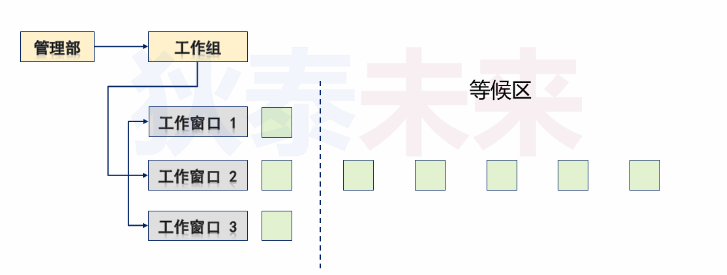
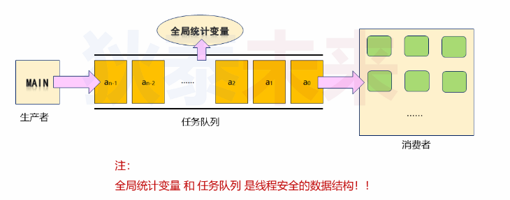

- [排队模型应用案例](#排队模型应用案例)
  - [排队模型回顾](#排队模型回顾)
    - [问题分析](#问题分析)
  - [线程池](#线程池)
  - [解决方案](#解决方案)
    - [问题升华](#问题升华)

# 排队模型应用案例

## 排队模型回顾

### 问题分析

* 如何模拟工作窗口
* 如何模拟等待中的顾客(如何模拟等待中的任务)
* 如何维护等待队列(数据结构)
* 工作时间如何模拟
* 新顾客如何模拟

## 线程池

背景
* 线程创建/销毁都会销毁额外资源
* 进程中不能无限制创建线程

方案
* 将多个线程预先创建在一个**池子**, 当需要时从池子中取出来

优势
* 降低创建/销毁线程带来的时间开销以及系统资源开销

## 解决方案

* 利用线程池模拟工作窗口，每个线程都是工作人员
* 定义任务结构体，模拟具体顾客
* 使用队列数据结构，模拟顾客排队
* 线程从队列取任务执行，模拟工作窗口服务顾客

> 注意：数据结构操作具有原子性

实现细节

* 各个线程从队列取任务需要互斥操作
* 如果队列为空，那么线程需要处于等待状态
* 主线程可以动态产生任务，放入队列
* 全局统计变量，可用于统计工作量

### 问题升华

