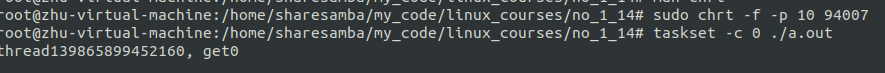
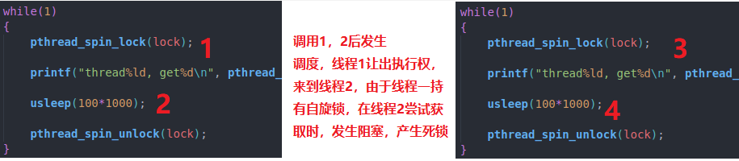

- [活锁方案与自旋锁](#活锁方案与自旋锁)
  - [互斥量获取超时API](#互斥量获取超时api)
  - [Linux中的自旋锁](#linux中的自旋锁)
  - [自旋锁 vs 互斥量](#自旋锁-vs-互斥量)
    - [场景](#场景)
    - [实现机制](#实现机制)
  - [Linux自旋锁API](#linux自旋锁api)
  - [自旋锁使用细则](#自旋锁使用细则)
  - [关于 PTHREAD\_MUTEX\_ADAPTIVE\_NP](#关于-pthread_mutex_adaptive_np)

# 活锁方案与自旋锁

问题：如何设置互斥锁的等待世界，如果等待超时，如何避免死锁

## 互斥量获取超时API

```C
#ifdef __USE_XOPEN2K
/* Wait until lock becomes available, or specified time passes. */
extern int pthread_mutex_timedlock (pthread_mutex_t *__restrict __mutex,
				    const struct timespec *__restrict
				    __abstime) __THROWNL __nonnull ((1, 2));
#endif

/* Unlock a mutex.  */
extern int pthread_mutex_unlock (pthread_mutex_t *__mutex)
     __THROWNL __nonnull ((1));


#include <time.h>
struct timespec {
    time_t   tv_sec;        /* seconds */
    long     tv_nsec;       /* nanoseconds */
};
int clock_gettime(clockid_t clk_id, struct timespec *tp);
```

思考：线程互斥量获取失败后发生了什么

一般情况下，可能会阻塞，释放处理器

## Linux中的自旋锁

* 自旋锁也是一种用来保证临界区原子性的机制
* 自旋锁与互斥量类似，同一时间，只能有一个持有者
* 自旋锁与互斥量区别：
  * 互斥量如果被持有，其他线程获取则会进入等待状态
  * 自旋锁如果被持有，其他线程则会循环检测尝试获取自旋锁，会一直占用处理器

## 自旋锁 vs 互斥量

### 场景
* 互斥量可以应对大多数场景，是一种普适的方案，副作用小
* 自旋锁使用场景小，副作用大
  > 自旋锁要求临界区非常小，且不能存在释放处理器的操作

### 实现机制

* 互斥量：设计上下文切换，存在效率上不足(时间资源)
* 自旋锁：一直循环尝试获取锁，不会进入阻塞(处理器资源)

## Linux自旋锁API

```C
/* Initialize the spinlock LOCK.  If PSHARED is nonzero the spinlock can
   be shared between different processes.  */

// __pshared: PTHREAD_PROCESS_PRIVATE, PTHREAD_PROCESS_SHARED
extern int pthread_spin_init (pthread_spinlock_t *__lock, int __pshared)
     __THROW __nonnull ((1));

/* Destroy the spinlock LOCK.  */
extern int pthread_spin_destroy (pthread_spinlock_t *__lock)
     __THROW __nonnull ((1));

/* Wait until spinlock LOCK is retrieved.  */
extern int pthread_spin_lock (pthread_spinlock_t *__lock)
     __THROWNL __nonnull ((1));

/* Try to lock spinlock LOCK.  */
extern int pthread_spin_trylock (pthread_spinlock_t *__lock)
     __THROWNL __nonnull ((1));

/* Release spinlock LOCK.  */
extern int pthread_spin_unlock (pthread_spinlock_t *__lock)
     __THROWNL __nonnull ((1));
```


运行结果：



可以看到，程序运行在单个CPU后，发生死锁了

为什么？



## 自旋锁使用细则

* 轻量级锁定：临界区较小，自旋锁持有时间短
* 同意线程不可不可重复获取自旋锁
* 如果只有单核处理器，不可使用自旋锁
* 线程一旦获取自旋锁，则不会释放CPU使用权
* 线程 从获取锁到释放锁，只能在同一个执行流

前面说到普通锁和自旋锁优缺点，那么是否存在，集2种锁优点的新的锁类型呢？

## 关于 PTHREAD_MUTEX_ADAPTIVE_NP

* 一种自适应锁
* 会优先自选方式获取锁
* 一旦超时则让出CPU使用权，进入等待状态
* 自适应锁比普通锁高效，比自旋锁安全