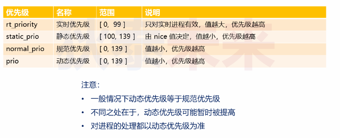
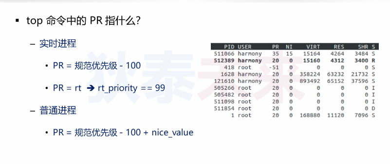
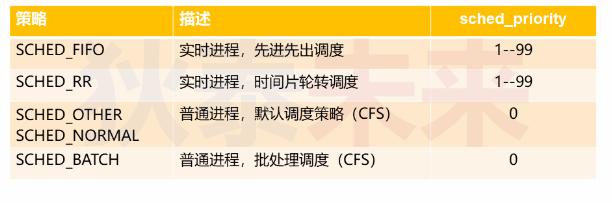
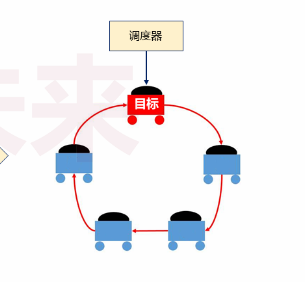

- [浅析进程优先级](#浅析进程优先级)
  - [什么是进程优先级](#什么是进程优先级)
  - [Linux中的进程类型（用户观点）](#linux中的进程类型用户观点)
    - [交互型进程](#交互型进程)
    - [批处理进程](#批处理进程)
  - [Linux中的进程类型（内核观点）](#linux中的进程类型内核观点)
    - [普通进程](#普通进程)
    - [实时进程](#实时进程)
  - [进程实时性和优先级](#进程实时性和优先级)
    - [实时性](#实时性)
    - [进程分类](#进程分类)
  - [进程优先级](#进程优先级)
  - [再论完全公平调度策略](#再论完全公平调度策略)
    - [完全公平策略如何计算进程获得多少时间片](#完全公平策略如何计算进程获得多少时间片)
    - [实验](#实验)
      - [API介绍](#api介绍)
  - [实时进程的调度策略](#实时进程的调度策略)
    - [深入实时进程优先级](#深入实时进程优先级)
  - [如何设置进程调度优先级](#如何设置进程调度优先级)
    - [接口介绍](#接口介绍)
    - [有趣的问题](#有趣的问题)
  - [思考](#思考)
    - [实验设计](#实验设计)

# 浅析进程优先级

## 什么是进程优先级
* 进程优先级：将处理器资源分配给进程的先后顺序
* Linux中每个进程都有相应的进程优先级(优先级可能会动态改变)
* 进程优先级决定进程何时执行，以及获取处理器的时间
* 进程优先级通常表现为一个整数值

## Linux中的进程类型（用户观点）

### 交互型进程

* 表现：比较多人机交互，进程不断进入阻塞状态，等待用户输入
* 特点：用户输入后，必须即时被唤醒执行处理

### 批处理进程

* 表现：不需要人机交互，在后台执行
* 特点：对时间不敏感，常用于数据处理

## Linux中的进程类型（内核观点）

### 普通进程

* 使用完全公平调度策略进程进程调度(```SCHED_OTHER```)
* 不能保证时间要求严格或者高优先级进程优先

### 实时进程

* 使用 ```SCHED_FIFO```或者```SCHED_RR```进行调度
* 根据进程优先级实时调度，在一定程度上保证实时性

## 进程实时性和优先级

### 实时性
* 硬实时 对时间要求非常严格，必须保证在一定时间完成
* 软实时 硬实时的弱化，允许一定程度上的超时时间

### 进程分类
* 普通进程 优先级[100, 139], 默认120，**值越小优先级越高**
* 实时进程 优先级[0, 99] **值越大优先级越高**

## 进程优先级



## 再论完全公平调度策略

* "完全公平" 不意味着都获得相同的时间片
* "完全公平" 指的是所有进程都能获得时间片

### 完全公平策略如何计算进程获得多少时间片
* 权重(weight)：进程按照权重分配时间片
* weight = 1024 / (1.25^nice)
* nice取值[-20, 19], 值越高权重越低

### 实验

父进程创建子进程，都进行复杂计算，子进程nice值设为5  
期望是父进程获得的时间片是子进程的3倍

#### API介绍

```C
#include <sys/time.h>
#include <sys/resource.h>

int getpriority(int which, int who);
int setpriority(int which, int who, int prio);
/*
which : 
  PRIO_PROGRESS: 指进程 
  PRIO_PGRP：进程组
  PRIO_USER：用户组
who：
  进程号或者进程组号
*/
```

```C
#include <stdio.h>
#include <stdlib.h>
#include <sys/types.h>
#include <unistd.h>
#include <math.h>
#include <errno.h>
#include <sys/time.h>
#include <sys/resource.h>

static void heavy_work()
{
    int i = 0;
    
    while( 1 )
    {
        sin(i++);
    }
}

static int set_nice(int nice)
{
    return setpriority(PRIO_PROCESS, 0, nice) == 0;
}

int main()
{
    int pid = fork();
    
    if( pid > 0 )
    {
        printf("pid = %d, ppid = %d, pgid = %d\n", 
                getpid(), getppid(), getpgrp());
                
        if( set_nice(0) )
        {
            heavy_work();
        }
        else
        {
            printf("set nice_value failed...\n");
        }
    }
    else if( pid == 0 )
    {
        printf("pid = %d, ppid = %d, pgid = %d\n", 
                getpid(), getppid(), getpgrp());
                
        if( set_nice(5) )
        {
            heavy_work();
        }
        else
        {
            printf("set nice_value failed...\n");
        }
    }
    else
    {
        printf("child process create failed...\n");
    }

    return 0;
}

```

## 实时进程的调度策略
* 在优先级不同时候，优先调度高优先级进程
* 当实时进程优先级相同时：  
  * ```SCHED_RR```采用时间片轮询方式，每次运行指定时间
  * ```SCHED_FIFO```采用先进先出策略，先占用处理器先调度方式

### 深入实时进程优先级
* 对于实时进程来说，内核模式和用户模式是不同的
  * 在内核模式，优先级值越小，优先级越高
  * 用户模式，优先级值越大，优先级越高
* 换算关系：```规范优先级 = MAX_RT_PRIO - 实时优先级 - 1```
  * ```MAX_RT_PRIO = 100```
  * 换算后得到的范围是[0, 99]
  
## 如何设置进程调度优先级

### 接口介绍

```C
#include <sched.h>

struct sched_param
{
  //...
  int sched_priority;
  //...
};

/*
pid: 指定进程号，如果 pid==0 则指定当前进程
policy: 策略 一般是 
        SCHED_OTHER, 
        SCHED_BATCH,
        上面这些策略 sched_priority必须大于0,
        同时还有其他：
        SCHED_RR
        SCHED_FIFO, 
*/

int sched_setscheduler(pid_t pid, int policy, const struct sched_param* param);

int sched_getscheduler(pid_t pid);

int sched_setparam(pid_t pid, const struct sched_param* param);

int sched_getparam(pid_t pid);
```



### 有趣的问题

调用上面的接口，一定能调用成功吗？

显然，不一定，为什么
  * 当调用进程是普通进程的时候，调用接口会失败
  * 因为设置调度优先级，需要root权限

## 思考

如何定制进程执行时间？

实现思路：模拟进程调度器实现
* 指定目标进程
* 执行进程
* 时间片完成，剥夺进程执行权限
* 调度下一个进程



### 实验设计

* 创建父进程，设置为实时进程，优先级是99
* 创建子进程，默认为普通进程
* 定义，各个子进程执行时间片
* 进入调度，根据时间片调度各个子进程

细节：
* 父进程利用```sleep()```，释放执行权限
* 在执行调度时，将当前进程设置为普通进程，将要执行的进程设置实时进程，利用优先级原理实现调度

注意：
* 这个方式是应用层 模拟内核的时间片轮询调度器
* 时间片不会非常精确


```C
#include <stdio.h>
#include <stdlib.h>
#include <sys/types.h>
#include <unistd.h>
#include <math.h>
#include <errno.h>
#include <sys/time.h>
#include <sys/resource.h>
#include <sched.h>
#include <signal.h>

static void heavy_work()
{
    int i = 0;
    
    while( 1 )
    {
        sin(i++);
    }
}

static int set_nice(int nice)
{
    return setpriority(PRIO_PROCESS, 0, nice) == 0;
}

int main()
{
    int pid = 0;
    struct sched_param sp = {0};
    pid_t pids[3] = {0};
    int ts[3] = {5, 3, 2};
    int i = 0;
    
    printf("pid = %d, ppid = %d, pgid = %d\n", 
                getpid(), getppid(), getpgrp());
                
    sp.sched_priority = 99;
        
    if( sched_setscheduler(0, SCHED_FIFO, &sp) != -1 )
    { 
        for(i=0; i<3; i++)
        {
            int pid = fork();
            
            if( pid > 0 )
            {
                pids[i] = pid;
                
                sp.sched_priority = 0;
                
                if( sched_setscheduler(pid, SCHED_OTHER, &sp) == -1 )
                {
                    printf("set policy error ==> %d\n", __LINE__);
                    kill(pid, SIGINT);
                }
            }
            else if( pid == 0 )
            {
                printf("pid = %d, ppid = %d, pgid = %d\n", 
                getpid(), getppid(), getpgrp());
                
                heavy_work();
            }
            else
            {
                printf("fork error ==> %d\n", __LINE__);
                exit(-1);
            }
        }
    }
    else
    {
        printf("set parent policy error ==> %d\n", __LINE__);
        exit(-1);
    }
    
    i = 0;
    
    while( 1 )
    {
        sp.sched_priority = 0;
                
        if( sched_setscheduler(pids[i], SCHED_OTHER, &sp) == -1 )
        {
            printf("set process to normal policy error ==> %d\n", __LINE__);
        }
        
        i = (i + 1) % 3;
        
        sp.sched_priority = 30;
                
        if( sched_setscheduler(pids[i], SCHED_FIFO, &sp) == -1 )
        {
            printf("schedule error ==> %d\n", __LINE__);
        }
        
        sleep(ts[i]);
    }
    return 0;
}
```
