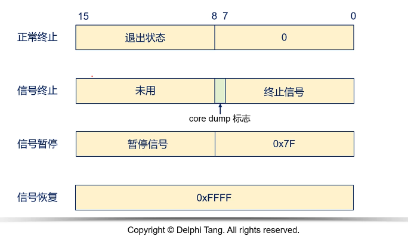
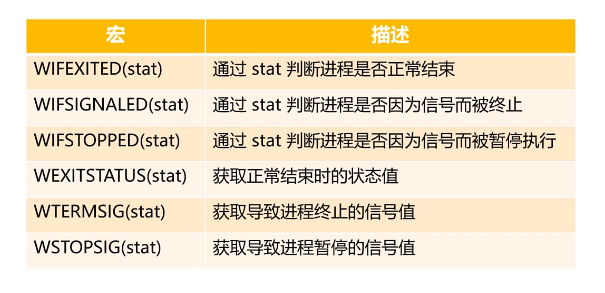

- [深入Linux进程](#深入linux进程)
  - [问题](#问题)
  - [僵尸进程](#僵尸进程)
    - [僵尸进程的危害](#僵尸进程的危害)


# 深入Linux进程

## 问题


**进程参数**和**环境变量**对进程意味着什么？
<br>
* 一般来说, 子进程是用来完成子任务, 并返回结果
* 而对于子进程来说, 需要父进程告诉子进程需要完成什么以及**传入数据(环境变量和进程参数)**

<br>
那对于环境变量以及进程参数, 改怎么选择?

* 对于代码设计原则:  
  1. 子进程启动必然会传入用到进程参数
  2. 对于环境变量子进程**可能**会用上


<br>
既然子进程是用来完成子任务, 那么当子进程完成任务后, 怎么将结果返回到父进程？

* 可以使用Linux的系统调用```wait```或```waitpid```
```C
#include <sys/types.h>
#include <sys/wait.h>

pid_t wait(int *wstatus);

pid_t waitpid(pid_t pid, int *wstatus, int options);
```
* ```wait(int *wstatus)```  
  1. 等待一个子进程结束, 并返回结果到 ```wstatus```
  2. 如果有多个子进程, 则随机返回其中一个子进程结果

* ```waitpid(pid_t pid, int *wstatus, int options)```  
   1. 等待指定的子进程
   2. 可以通过```options```选项是否阻塞等待    
        ```options > 0``` 等待指定进程  
        ```options == 0``` 等待**当前进程组**任意进程  
        ```options == -1``` 等待任意进程  
        ```options < -1``` 等待指定进程组任意进程

可以说```waitpid```是进阶版```wait```

<br>

思考下, 子进程返回结果到父进程, 一定是通过 ```return``` 语句吗？ 

* 不一定, Linux提供进程退出系统接口

```C
#include <unistd.h>

void _exit(void);
```

```C
#include <stdlib.h>

void exit(int status);

void abort(void);
```

* ```_exit()``` 为系统调用, 终止当前进程
* ```exit()``` 为库函数, 释放进程资源再终止进程, 
* ```abort()``` 为库函数, 通过发送信号异常终止当前进程

进程退出/终止后的返回状态值:




示例代码:

```C
#include <stdlib.h>
#include <sys/types.h>
#include <sys/wait.h>
#include <unistd.h>
#include <stdio.h>

int main(int argc, char* argv[])
{
    int ret = 0;
    int a = 0;
    int b = 1;
    int status = 0;

    if((ret = fork()) == 0) exit(-1);

    printf("child : %d\n", ret);


    if((ret = fork()) == 0) abort();

    printf("child : %d\n", ret);

    
    if((ret = fork()) == 0) a = b / a, exit(1);

    printf("child : %d\n", ret);

    sleep(3);

    while((ret = wait(&status)) != -1)
    {
        printf("ori status %d\n", status);
        if(WIFEXITED(status))
        {
            printf("normal exit child : %d return %02x -- %02x\n", ret, status, WEXITSTATUS(status));
        }
        else if(WIFSIGNALED(status))
        {
            printf("signaled child %d return %02x -- %02x\n", ret, status, WTERMSIG(status));
        }
        else
        {
            printf("stopped child %d return %02x -- %02x\n", ret, status, WEXITSTATUS(status));
        }
    }

    return 0;
}
```

## 僵尸进程
* 理论上, 子进程退出/终止后, 都是释放进程资源
* 但是为了给父进程提供必要的信息, 都会保留部分资源不会被释放
* 当父进程获取到对应信息后(调用```wait```或```waitpid```), 才会完全释放  
  1. 父进程调用```wait```, 会为子进程"收尸"
  2. 如果父进程推出了, init进程会接管子进程, 并且会为其"收尸"

### 僵尸进程的危害
* 僵尸进程会保留进程退出前的状态和资源使用情况
* 如果僵尸进程不处理, 那么有可能会影响后续进程创建
  1. 创建进程需要内存和进程标识
  2. 僵尸进程会一直保留有进程标识和一定内存, 不释放的话一定程度可认为是**内存泄漏**
  3. 僵尸进程过多会导致进程标识不足无法创建进程

僵尸进程代码示例
```C
#include <sys/types.h>
#include <sys/wait.h>
#include <unistd.h>
#include <stdio.h>

void work()
{
    sleep(30);
    printf("grand son working end %d\n", getpid());
}

int main(int argc, char* argv[])
{
    int status;
    int child_pid;

    if((child_pid = fork()) == 0)
    {
        for(int i = 0; i < 5; i++)
        {
            if(fork() == 0)
            {
                work();
                break;
            }
        }

        sleep(40);
        printf("end child\n");
    }
    else
    {
        printf("parent %d\n", getpid());
        while(wait(&status) == child_pid)
        {
            printf(" wait child\n");
        }

        sleep(60);
    }

    return 0;
}

```