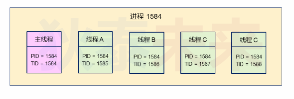
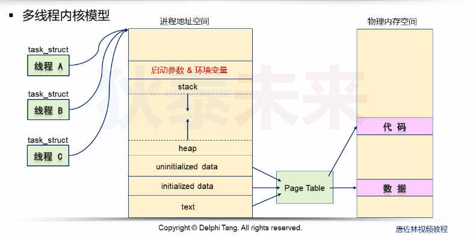
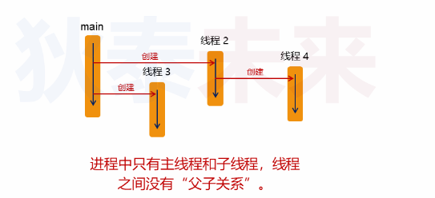

- [深入浅出线程原理](#深入浅出线程原理)
  - [Linux线程本质](#linux线程本质)
    - [问题](#问题)
  - [辅助工具](#辅助工具)
  - [多线程内核模型](#多线程内核模型)
  - [值得思考的问题](#值得思考的问题)
    - [多线程是否有父子关系？](#多线程是否有父子关系)
    - [主线程如果先于子线程结束会发生什么](#主线程如果先于子线程结束会发生什么)
    - [使用kill命令能否杀死指定线程](#使用kill命令能否杀死指定线程)
    - [```pthread_t```究竟是什么数据类型](#pthread_t究竟是什么数据类型)
  - [Linux API介绍](#linux-api介绍)


# 深入浅出线程原理

## Linux线程本质

* 线程接口由native POSIX Thread library提供，即NPTL库函数
* 线程一般称为轻量级进程（light weight process）
* 每个线程在内核都有一个调度实体，实际上是结构体 ```task_struct```
  
> 在内核设计中，一个进程对应内核中一个结构体，对应一个进程标识
> 那么在引入线程后，线程作为内核的调度实体，也会有一个结构体

在用户模式下:一个进程有多个线程，而在内核模式下每个线程都是独立的调度实体  
那么有一个问题 **内核怎么知道调度实体属于哪个进程**

所以这里应该有一个标识符号，标识线程归属

* 在多线程的进程，就是线程组(谁是组长)
* 在内核数据结构```task_struct```中，存在```pid, tgid```
  * ```pid_t pid```是线程标识符
  * ```pid_t tgid```是线程组标识

```C
// 线程标识符
pid_t gettid();

// 进程标识符
pid_t getpid();
```

而前面说的，既然有线程组，那么谁是组长？

* 进程创建后默认有一个主线程（默认执行流）
* 主线程的线程标识符和进程标识符相等，所以，主线程是线程组长
* 其他子线程隶属于当前进程，只是线程标识符不同

### 问题
对于线程来说，```pthread_t```和```pid_t```有什么区别

* 线程```pid_t```是全局的唯一标识
* 线程```pthread_t```是局部描述，针对当前进程对线程的描述

## 辅助工具

使用 ```ps -eLF```查看线程信息
```C
-e // 选择所有进程
-L // 显示线程信息，包括LWP和NLWP
-f // 显示详细信息
```

## 多线程内核模型



Linux内核的基本调度单位是任务，即以```task_struct```为单位



* 一个可执行文件在加载执行后生成进程，而在加载这一步会申请系统资源，这里最重要的就是进程内存空间
* 内存空间申请了，就应该使用它才有意义，而使用者就是**执行流，谁是执行流？就是线程**
* 线程跑起来之前，就需要创建它，而线程创建**本质上就是创建一个结构体实例**，创建好后，将内存地址指针指向当前的进程内存空间上，这样就实现了多线程内存内存资源共享

```C
#include <stdio.h>
#include <stdlib.h>
#include <unistd.h>
#include <string.h>
#include <stdio.h>
#include <sys/types.h>
#include <sys/wait.h>
#include <sys/syscall.h>
#include <pthread.h>

pid_t gettid(void)
{
    return syscall(SYS_gettid);
}

void* thread_entry(void* arg)
{   printf("thread: %ld\n", pthread_self());
    while(1)
    {
        pid_t pid = getpid();
        pid_t tid = gettid();
    
        printf("pid = %d, tid = %d\n", pid, tid);
        sleep(5);
    }
    
    return NULL;
}

int main()
{
    int i = 0;
    pthread_t t = 0;
    pid_t pid = getpid();
    pid_t tid = gettid();
    
    printf("main:pid = %d\n", pid);
    printf("main:tid = %d\n", tid);
    
    for(i=0; i<4; i++)
        pthread_create(&t, NULL, thread_entry, NULL);
    
    while(1)
        sleep(1);

    return 0;
}
```
## 值得思考的问题

### 多线程是否有父子关系？



### 主线程如果先于子线程结束会发生什么

* Linux中主线程结束意味者进程结束，就会释放资源，子线程也会被迫结束

### 使用kill命令能否杀死指定线程

* ```kill```不能杀死指定线程，
* ```kill```会发出SIGTERM信号，而信号的接收者是进程
* 发送SIGTERM信号默认情况下会结束整个进程

### ```pthread_t```究竟是什么数据类型

* ```pthread_t```是POSIX标准定义的类型，具体的类型实现与系统相关，可以是一个整型也可以是一个结构体
* 在Linux中是一个64位整型

## Linux API介绍

```C
#include <pthread.h>

int pthread_equal(pthread_t t1, pthread_t t2);

// Compile and link with -pthread.
```
> 在Linux系统中可以直接使用 t1 == t2判断线程相等
> 而在需要编写可移植性高的代码时，就需要使用上述接口