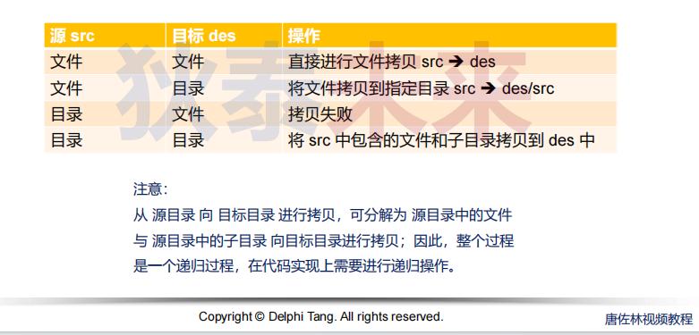
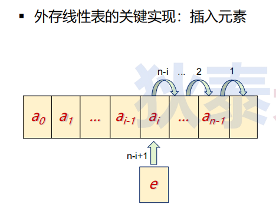
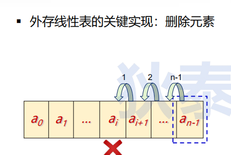

- [目录与文件编程练习](#目录与文件编程练习)
  - [问题：如何编程实现目标的拷贝，与目录删除的方法相同吗？](#问题如何编程实现目标的拷贝与目录删除的方法相同吗)
  - [思考: 利用文件能否实现外存数组和外存线性表呢？](#思考-利用文件能否实现外存数组和外存线性表呢)
    - [线性表回顾](#线性表回顾)


# 目录与文件编程练习

## 问题：如何编程实现目标的拷贝，与目录删除的方法相同吗？

* 综合小练习
    * 需求：编写程序拷贝指定目录
    * 通过命令行参数指定 源目录 与 目标目录
    * 源目录中的文件与子目录需要完整拷贝
    * 出现目标目录中的同名文件冲突时提示是否覆盖
    * 目标目录中的其它文件不受拷贝操作的影响

* 解决方案
  * 目录由包含的文件和子目录构成，所以目录的拷贝就是所包含文件和所包含子目录的拷贝！

* 重点：如何保证完整拷贝  
    Linux中目录与文件除了文件内容外，还有元数据，完整拷贝指需要将元数据进行拷贝元数据包含最重要的权限信息




```C
#define CHUNK (BUFSIZ)

static mode_t get_mode(const char* src)
{
	struct stat fst = {0}; 

	stat(src, &fst);

	return fst.st_mode & 0xFFF;
}

static int is_overwrite(char* dst)
{
	char write = 1;
	char c = 0;

	if(access(dst, F_OK) == 0)
	{
REINPUT:
		printf("%s exits, do you want to overwrite it?(Y/N): ", dst);
		scanf("\n%c", &c);

		if(c == 'y' || c == 'Y')
		{
			write = 0;
		}
		else if(c == 'n' || c == 'N')
		{
			write = 1;
		}
		else
		{
			goto REINPUT;
		}

	}

	return write;
}

int copy(char* src, char* dst)
{
	int ret = 0;
	int fd = 0;
	struct stat src_fst = {0}; 
	struct dirent* dir_info = NULL;

	// src or dst is NULL?

	fd = open(src, O_RDONLY);

	if(fd)
	{
		stat(src, &src_fst);

		if(S_ISDIR(src_fst.st_mode))
		{
			DIR* dir = opendir(src);

			if(0 != access(dst, F_OK))
			{
				mkdir(dst, get_mode(src));
			}

			while((dir_info = readdir(dir)) != NULL)
			{
				if(strcmp(dir_info->d_name, ".") == 0 || strcmp(dir_info->d_name, "..") == 0)
				{
					continue;
				}

				char next_src[256] = {0};
				char next_dst[256] = {0};
	
				strcat(next_src, src);
				strcat(next_src, src[strlen(src)-1] != '/' ? "/" : "");
				strcat(next_src, dir_info->d_name);

				strcat(next_dst, dst);
				strcat(next_dst, "/");
				strcat(next_dst, dir_info->d_name);

				//printf("copy %s ---> %s\n", next_src, next_dst);

				copy(next_src, next_dst);
			}

			closedir(dir);
		}
		else if(S_ISREG(src_fst.st_mode))
		{
			int dst_fd = 0;

			if(is_overwrite(dst))
			{
				dst_fd = open(dst, O_WRONLY | O_CREAT, get_mode(src));

				if(dst_fd > 0)
				{
					int cnt = 0;
					char buf[CHUNK] = {0};

					do{
						cnt = read(fd, buf, sizeof(buf[0]) * CHUNK);
						write(dst_fd, buf, cnt);
					}while(cnt >= CHUNK);

					close(dst_fd);
				}
				else
				{
					printf("write to %s failed(%s)\n", dst, strerror(errno));
					ret = -1;
				}
			}
		}
		else
		{
			printf("%s is not regular file or directory\n", src);
			ret = -1;
		}

		close(fd);
	}
	else
	{
		printf("%s open failed\n", src);
		ret = -1;
	}
	

	return ret;
}
```


## 思考: 利用文件能否实现外存数组和外存线性表呢？

### 线性表回顾

线性表可以采用顺序存储结构实现：
  * 零个或多个数据元素组成的集合
  * 数据元素在位置上是有序排列的
  * 数据元素的个数是有限的
  * 数据元素的类型必须相同

线性表（List）的性质  
  * a0 为线性表的第一个元素，只有一个后继
  * an-1 为线性表的最后一个元素，只有一个前驱
  * 除 a0 和 an-1 外的其它元素 ai，既有前驱，又有后继
  * 直接支持逐项访问和顺序存取





```C
#ifndef EARRAY_H
#define EARRAY_H

typedef void EArray;

#define EArray_init(type, cnt) EArray_init_(cnt, sizeof(type))

#define EArray_set(arr, type, index, val) ({      \
    type v = val;                                 \
    int ret = EArray_set_(arr, index, (void*)&v); \
    ret;                                          \
})

#define EArray_get(arr, type, index) ({    \
    type r;                                \
    int ret = EArray_get_(arr, index, &r); \
    r;                                     \
})

#define EArray_append(arr, type, val) ({  \
    type v = val;                         \
    EArray_append_(arr, &v);              \
})

EArray* EArray_init_(unsigned int cnt, unsigned int size);

int EArray_set_(EArray* ea, unsigned int index, const void* buf);

int EArray_get_(EArray* ea, unsigned int index, void* buf);

int EArray_append_(EArray* ea, const void* buf);

int EArray_length(EArray* ea);

void EArray_release(EArray* ea);

#endif
```

```C
#include <stdlib.h>
#include <stdio.h>
#include <unistd.h>
#include <sys/types.h>
#include <sys/stat.h>
#include <sys/time.h>
#include <fcntl.h>
#include <errno.h>
#include "EArray.h"

typedef struct
{
    int fd;
    int length;
    int block_size;
    char name[32];
}_EArray;

EArray* EArray_init_(unsigned int cnt, unsigned int size)
{
    _EArray* ea = (EArray*)calloc(cnt, size);

    if(ea)
    {
        struct timeval t = {0};

        gettimeofday(&t, NULL);

        sprintf(ea->name, "%ld_%ld.tmp", t.tv_sec, t.tv_usec/1000);

        ea->fd = open(ea->name, O_CREAT | O_RDWR, S_IRUSR | S_IWUSR);

        if(ea->fd < 0)
        {
            free(ea);
            ea = NULL;
        }
        else
        {
            ea->length = cnt;
            ea->block_size = size;
        }
    }

    return ea;
}

int EArray_set_(EArray* ea, unsigned int index, const void* buf)
{
    int ret = 0;
    _EArray* e = (_EArray*)ea;

    if(e && buf && (index < e->length))
    {
        lseek(e->fd, index * e->block_size, SEEK_SET);
        
        ret = write(e->fd, buf, e->block_size);
    }

    return ret;
}

int EArray_get_(EArray* ea, unsigned int index, void* buf)
{
    int ret = 0;
    _EArray* e = (_EArray*)ea;

    if(e && buf && (index < e->length))
    {
        lseek(e->fd, index * e->block_size, SEEK_SET);

        ret = read(e->fd, buf, e->block_size);
    }

    return ret;
}

int EArray_append_(EArray* ea, const void* buf)
{
    int ret = 0;
    _EArray* e = (_EArray*)ea;

    if(e && buf)
    {
        ret += write(e->fd, buf, e->block_size);

        e->length++;
    }
}

int EArray_length(EArray* ea)
{
    _EArray* e = (_EArray*)ea;

    return e ? e->length : -1;
}

void EArray_release(EArray* ea)
{
    _EArray* e = (_EArray*)ea;

    if(e)
    {
        close(e->fd);
        unlink(e->name);
        free(ea);
    }
}
```