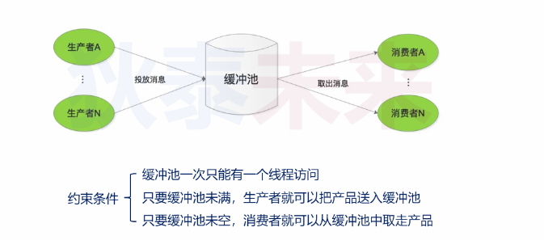
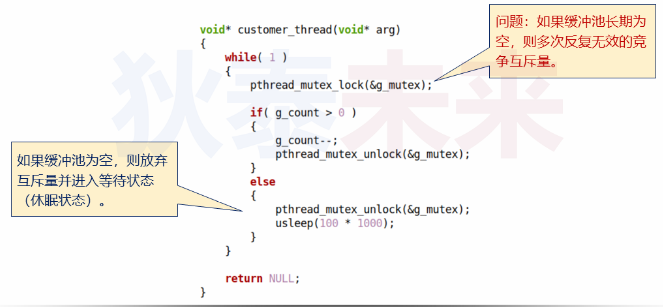
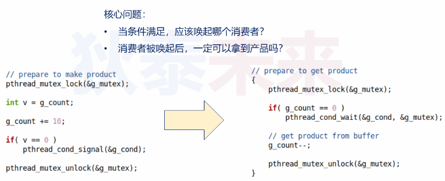
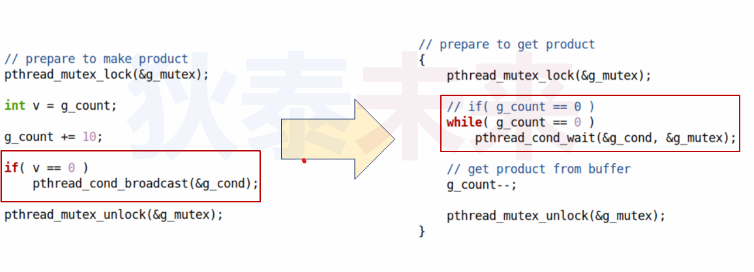

- [线程同步和条件变量](#线程同步和条件变量)
  - [再论生产者消费者问题](#再论生产者消费者问题)
    - [新的需求](#新的需求)
  - [Linux中的条件变量](#linux中的条件变量)
    - [条件变量注意事项](#条件变量注意事项)
  - [一个生产者VS多消费者](#一个生产者vs多消费者)


# 线程同步和条件变量

## 再论生产者消费者问题



问题：如果缓冲池为空，那么如何定义消费者行为呢



### 新的需求

* 消费者发现缓冲池为空，那么就让出互斥量，进入等待状态
* 当缓冲池为空时候：生成者生成完，就通知消费者

关键：
* 消费者不需要反复无效竞争
* 生成者可以通知消费者再次竞争

## Linux中的条件变量

```C
/* Functions for handling conditional variables.  */

/* Initialize condition variable COND using attributes ATTR, or use
   the default values if later is NULL.  */
extern int pthread_cond_init (pthread_cond_t *__restrict __cond,
			      const pthread_condattr_t *__restrict __cond_attr)
     __THROW __nonnull ((1));

/* Destroy condition variable COND.  */
extern int pthread_cond_destroy (pthread_cond_t *__cond)
     __THROW __nonnull ((1));

/* Wake up one thread waiting for condition variable COND.  */
extern int pthread_cond_signal (pthread_cond_t *__cond)
     __THROWNL __nonnull ((1));

/* Wake up all threads waiting for condition variables COND.  */
extern int pthread_cond_broadcast (pthread_cond_t *__cond)
     __THROWNL __nonnull ((1));

/* Wait for condition variable COND to be signaled or broadcast.
   MUTEX is assumed to be locked before.

   This function is a cancellation point and therefore not marked with
   __THROW.  */
extern int pthread_cond_wait (pthread_cond_t *__restrict __cond,
			      pthread_mutex_t *__restrict __mutex)
     __nonnull ((1, 2));

/* Wait for condition variable COND to be signaled or broadcast until
   ABSTIME.  MUTEX is assumed to be locked before.  ABSTIME is an
   absolute time specification; zero is the beginning of the epoch
   (00:00:00 GMT, January 1, 1970).

   This function is a cancellation point and therefore not marked with
   __THROW.  */
extern int pthread_cond_timedwait (pthread_cond_t *__restrict __cond,
				   pthread_mutex_t *__restrict __mutex,
				   const struct timespec *__restrict __abstime)
     __nonnull ((1, 2, 3));
```
### 条件变量注意事项

* 条件变量不能互相赋值初始化
* 使用```pthread_cond_init```初始化，必须调用```pthread_cond_destroy```销毁
* 使用```PTHREAD_COND_INITIALIZER```不需要销毁
* ```pthread_cond_wait```只能由拥有互斥量线程调用

为什么```pthread_cond_init```需要互斥量？  
* 在具体实现中，每次等待条件变量，内部的引用计数就是加1，并且把当前线程加入等待队列而这个这个增加的过程需要线程安全，就需要一个互斥量

## 一个生产者VS多消费者




存在几个问题:
* 有可能其中一个消费者获取条件变量后其他线程将永远等待
* 条件满足是随机唤醒一个消费者

解决方案



```C
#include <pthread.h>
#include <stdio.h>
#include <unistd.h>

static pthread_cond_t cond;
static pthread_mutex_t mutex;

static int g_count;

void* customer_thread(void* arg)
{
    long index = (long)arg;

    while(1)
    {
        pthread_mutex_lock(&mutex);

        while(g_count == 0)
        {
            pthread_cond_wait(&cond, &mutex);
        }

        printf("%s%ld: consume: %d\n", __FUNCTION__, index, --g_count);

        pthread_mutex_unlock(&mutex);

        //usleep(100 * 1000);
    }

    return NULL;
}

int main()
{
    int pre = 0;
    pthread_t tids[3] = {0};

    pthread_mutex_init(&mutex, NULL);
    pthread_cond_init(&cond, NULL);

    for(long i = 0; i < sizeof(tids)/sizeof(tids[0]); i++)
    {
        pthread_create(&tids[i], NULL, customer_thread, (void*)i);
    }

    while(1)
    {
        pthread_mutex_lock(&mutex);

        pre = g_count;

        g_count += 2;

        printf("%s : product: %d\n", __FUNCTION__, g_count);

        if(pre == 0)
        {
            //pthread_cond_signal(&cond);
            pthread_cond_broadcast(&cond);
        }

        pthread_mutex_unlock(&mutex);

        usleep(1000 * 1000);
    }

    return 0;
}
```