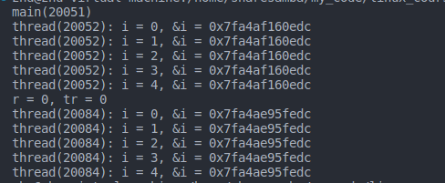
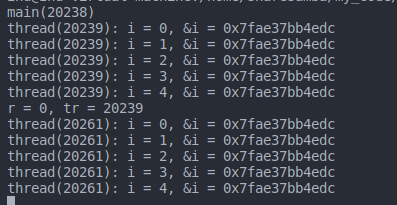

- [线程的连接与分离](#线程的连接与分离)
  - [再论线程返回值](#再论线程返回值)
  - [pthread\_join vs wait](#pthread_join-vs-wait)
  - [再论wait和waitpid](#再论wait和waitpid)
  - [问题](#问题)
  - [线程的分离](#线程的分离)


# 线程的连接与分离

## 再论线程返回值

```C
#include <pthread.h>

// ESRCH: 线程标识不存在
// EINVAL: 线程不可连接或者已经连接
// EDEADLK: 存在死锁行为，即自己连接自己
int pthread_join(pthread_t thread, void **retval);
```

## pthread_join vs wait

* 进程之间的等待只能是父进程等待子进程
* 线程之间都可以等待
* **wait**等待任意进程退出，```pthread_join```须指定线程ID
* ```pthread_join```等待的必然是```pthread_create```创建的线程

下面程序输出什么？

```C
#define _GNU_SOURCE     /* To get pthread_getattr_np() declaration */
#include <pthread.h>
#include <stdio.h>
#include <stdlib.h>
#include <unistd.h>
#include <memory.h>
#include <sys/syscall.h>

pid_t gettid(void)
{
    return syscall(SYS_gettid);
}

void* thread_entry(void* arg)
{ 
    pid_t pt = gettid();
    
    int i = 0;
    int n = (long long)arg;
    
    for(i=0; i<n; i++)
    {
        printf("thread(%d): i = %d\n", pt, i);
        sleep(1);
    }
    
    return (void*)pt;
}

void* wait_entry(void* arg)
{ 
    pid_t pt = gettid();
    pthread_t t = (pthread_t)arg;
    int r = 0;
    
    sleep(1);
    
    r = pthread_join(t, NULL);
    
    printf("thread(%d) r = %d\n", pt, r);
    
    return NULL;
}

int main()
{
    int r = 0;
    void* tr = NULL;
    
    pthread_t t = 0;
    pthread_t wt = 0;
    
    printf("main(%d)\n", getpid());
    
    pthread_create(&t, NULL, thread_entry, (void*)5);
    pthread_create(&wt, NULL, wait_entry, (void*)t);
    pthread_create(&wt, NULL, wait_entry, (void*)t);
    
    while(1)
    {
        sleep(6);
    }
    
    return 0;
}
```

在Linux平台下，出现其中一个 ```wait_entry```无法退出情况  

原因：多个线程同时join同一个线程，**行为是未定义的**，在Linux平台是阻塞了，在其他平台又会是其他结果可能是崩溃

## 再论wait和waitpid

* 子进程退出/终止后，部分资源并未释放，（为父进程提供重要信息）
* 父进程调用```wait```/```waitpid```后，为子进程释放资源
* 如果子进程的不回收，那么可能会影响正常进程创建，因为子进程的标识符未释放，会一直占用，最终累计导致创建进程失败

## 问题
子线程退出后，释放意味着线程资源被回收

下面程序输出什么
```C
#define _GNU_SOURCE     /* To get pthread_getattr_np() declaration */
#include <pthread.h>
#include <stdio.h>
#include <stdlib.h>
#include <unistd.h>
#include <memory.h>
#include <sys/syscall.h>

pid_t gettid(void)
{
    return syscall(SYS_gettid);
}

void* thread_entry(void* arg)
{ 
    pid_t pt = gettid();
    
    int i = 0;
    int n = (long long)arg;
    
    for(i=0; i<n; i++)
    {
        printf("thread(%d): i = %d, &i = %p\n", pt, i, &i);
        sleep(1);
    }
    
    return (void*)(long)pt;
}

int main()
{
    int r = 0;
    void* tr = NULL;
    
    pthread_t t = 0;
    pthread_t wt = 0;
    
    printf("main(%d)\n", getpid());
    
    pthread_create(&t, NULL, thread_entry, (void*)5);
    
    sleep(6);
    
    // r = pthread_join(t, &tr);
    
    pthread_create(&t, NULL, thread_entry, (void*)5);
    
    printf("r = %d, tr = %ld\n", r, (long)tr);
    
    sleep(10);
    
    return 0;
}
```
输出结果：


可以看到变量```i```的地址不一样

那么把注释 ```// r = pthread_join(t, &tr);```去掉看看：



可以看到，这时候变量```i```的地址是一样的

结论：  
* 默认情况下，Linux不会主动释放线程资源
* ```pthread_join```不仅会等待线程结束，还会释放线程资源
* 创建过多线程但是不等的结束，会造成资源泄漏
* 任意线程都可以释放已经退出的线程

## 线程的分离

* 默认情况下线程是可连接的
* 可连接的线程在退出后需要执行join，否则无法释放资源

实际需求：
* 线程不需要返回值，那么退出后不应该需要连接
* 线程退出后自动释放资源

```C

// 创建线程前调用 指定分离属性
void pthread_attr_setdetachstate(pthread_attr_t* attr, int detachstate);

void pthread_attr_getdetachstate(const pthread_attr_t* attr, int* detachstate);

// 可在创建后设置为分离状态
int pthread_detach(pthread_t thread);
```

> 在实际工程开发中，一定要做好线程设计，如 线程间是否需要等待等