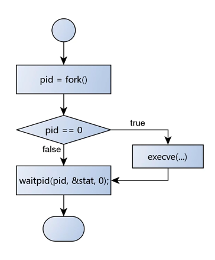

- [进程创建盘点](#进程创建盘点)
  - [fork与vofrk](#fork与vofrk)
    - [再论进程创建](#再论进程创建)
    - [深入理解vfork](#深入理解vfork)
  - [exec与system](#exec与system)
    - [exec](#exec)
    - [system](#system)

# 进程创建盘点


## fork与vofrk

回顾下前面的创建进程示例

```C
int CreateProcess(const char* path, char* const argv[])
{
	int ret = 0;

	if((ret = fork()) == 0)
	{
		execve(path, argv, NULL);
	}

	return ret;
}
```
* 在子进程中调用```execve```重置子进程内存空间方式执行新任务

### 再论进程创建


```C
pid_t vfork();
```
* 用于创建子进程, 但是不会复制父进程内存空间数据
* 创建的子进程直接使用父进程内存空间
* 在子进程中修改的数据直接反映到父进程空间
* ```vfork```和```execve```搭配使用
  ***(为什么可以？)***  
  * 因为在调用```execve```重新为子进程重新分配了内存空间, 所以不会干扰到父进程

看下面示例
```C
#include <sys/types.h>
#include <unistd.h>
#include <stdio.h>

int main(int argc, char* argv[])
{
    pid_t pid = 0;
    int var = 66;

    printf("parent proc: %d\n", getpid());    

    if((pid = vfork()) == 0)
    {
        printf("proc: %d , var : %d\n", getpid(), var);
        
        var++;
        printf("proc: %d , var : %d\n", getpid(), var);

        return 0;
    }
    else if(pid < 0)
    {
        printf("vfork err\n");
    }

    printf("parent proc: %d , var : %d\n", getpid(), var);    

    return 0;
}
```
* 上述示例运行后直接coredump, 这是为什么

### 深入理解vfork
* ```vfork```成功后, 父进程会等待子进程借结束
* 子进程可以使用父进程的数据区(堆, 栈, 全局)
* 子进程可以调用其他函数, **但是不能调用```return```**
  * 因为子进程调用```return``` 那么系统就会回收栈, 但是当前父进程的栈指针还是指向原来的地方, 导致了父进程出错
  * ```vfork```指向完任务后 应该使用 ```_exit```系统调用退出

修改后的示例
```C
#include <sys/types.h>
#include <unistd.h>
#include <stdio.h>

int main(int argc, char* argv[])
{
    pid_t pid = 0;
    int var = 66;

    printf("parent proc: %d\n", getpid());    

    if((pid = vfork()) == 0)
    {
        printf("proc: %d , var : %d\n", getpid(), var);
        
        var++;
        printf("proc: %d , var : %d\n", getpid(), var);

        _exit(0);
    }
    else if(pid < 0)
    {
        printf("vfork err\n");
    }

    printf("parent proc: %d , var : %d\n", getpid(), var);    

    return 0;
}
```

从上面的示例看出:
* 虽然```vfork```比```fork```少了一次内存空间拷贝, 但是如果使用不当很容易造成程序出问题,所以从工程角度来说, 使用```fork```会比```vfork```更好

```vfork```相比```fork```效率高, 那么```fork```是否有优化空间？

* 现代的```fork```采用了COW(Copy-On-Write)技术, 只有在写入操作发生时才会复制进程空间
* 这样基本上 ```fork```和```vfork``` 在效率上就基本等价了

## exec与system

### exec
```exec```族函数

```C
#include <unistd.h>

extern char **environ;

int execl(const char *pathname, const char *arg, .../* (char  *) NULL */);
int execlp(const char *file, const char *arg, .../* (char  *) NULL */);
int execle(const char *pathname, const char *arg, .../*, (char *) NULL, char *const envp[] */);
int execv(const char *pathname, char *const argv[]);
int execvp(const char *file, char *const argv[]);
int execvpe(const char *file, char *const argv[], char *const envp[]);
```
注意这里函数名的后缀 
1. ```l``` 即 list, 代表子进程参数由函数的参数列表传入
2. ```p``` 即 ```PATH```, 代表要加载的可执行文件, 到```PATH```环境变量指定的路径中寻找 
3. ```v``` 即 vector 数组, 代表进程参数由数组传入
4. ```e``` 即环境变量, 代表子进程环境变量由父进程提供

### system

回顾下前面写的创建进程流程:



在Linux中也提供了类似且功能更加强大的库函数
```C
#include <stdlib.h>

int system(const char *command);
```
```command``` 是传入要执行的命令

注意
* ```system```函数在内部是先创建了 ```shell```进程, 再创建目标进程, 所以这里有2次创建过程,效率上会低一点


