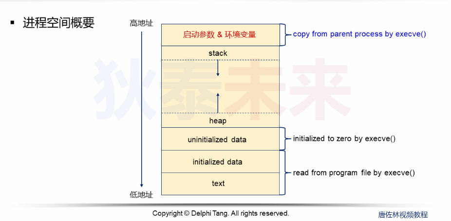
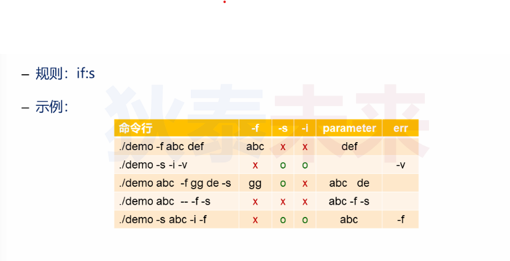

- [进程参数编程](#进程参数编程)
	- [问题回顾](#问题回顾)
	- [Linux启动参数](#linux启动参数)
	- [Linux启动参数编程](#linux启动参数编程)


# 进程参数编程

## 问题回顾

**```execve()```参数分别是什么, 有什么意义**

```C
#include <unistd.h>
execve(const char* pathname, char* const argv[], char* constenvp[]);
```

* ```argv[]```是启动参数
* ```env[]```是环境变量



* 注意: 启动参数和环境变量都是由父进程拷贝到子进程、

## Linux启动参数

* 由选项, 选项值, 操作数组成
* 选项由短横线```-```开始, 选项名必须是单个字符或数字字符
* 选项可以由选项值, 选项与选项值之间可用空格分隔 ```-o test <==> -otest```
* 如果多个选项均无选项值, 可合而为一 ```-a -b <==> -ab```
* 既不是选项, 也不是选项值的参数是操作数
* 第一次出现的双横线```--```, 用于结束所有选项, 后面的参数均为操作数


## Linux启动参数编程

```C
#include <unistd.h>

extern char* optarg;
extern int optind, opterr, optopt;

int getopt(int argc, char* const argv, const char* optstring);
```

* ```getopt()```从```argv```中获取启动参数, 并根据 ```optstring```定义的规则解析    
* 选项合法 返回选项字符, ```optarg```指向选项值
* 选项不合法 返回字符```?```, ```optopt```指向选项字符
* 选项合法但是缺少选项值 返回```:```, ```optopt```指向选项字符
* 默认情况下 会对```argv```重排 把操作数放到最后



```:```**表示其前面的选项后必须带有选项值**  
```::```**表示其前面的选项后可以带有选项值也可不带选项**


```optstring```扩展补充：
* 其实字符可以是 ```: + -```或省略
* 省略: 出错时会返回```:```或```?```进行处理, 并有错误提示
* ```:``` 错误提示开关, 关闭错误提示, 出错时会返回```:```或```?```进行处理
* ```+``` 提前停止开关, 遇到操作数时返回 -1, 认为已经处理完成(后续都认为操作数)
* ```-``` 不重排开关, 遇见操作数返回 1, ```optarg```指向操作数


```C
int main(int argc, char* argv[])
{
	int ret = 0;
	int opt_a = 0;
	int opt_b = 0;
	int opt_f = 0;
	char f_value[16] = {0};

	while((ret = getopt(argc, argv, "-:f:ab")) != -1)
	{
		switch(ret)
		{
			case 'f':
				opt_f = 1;
				memcpy(f_value, optarg, strlen(optarg));
			break;
			case  'a':
				opt_a = 1;
			break;
			case 'b':
				opt_b = 1;
			break;
			case '?':
				printf("unknown opt %c\n", optopt);
			break;
			case ':':
				printf("cmd %c need paramter\n", optopt);
			case 1:
				printf("get paramter %s\n", optarg);
			break;
		}
	}

	printf("opt a %d == opt b %d == opt f %d %s\n", opt_a, opt_b, opt_f, f_value);

	for(int i = optind; i < argc; i++)
	{
		printf("opt : %s\n", argv[i]);
	}

	return 0;
}
```