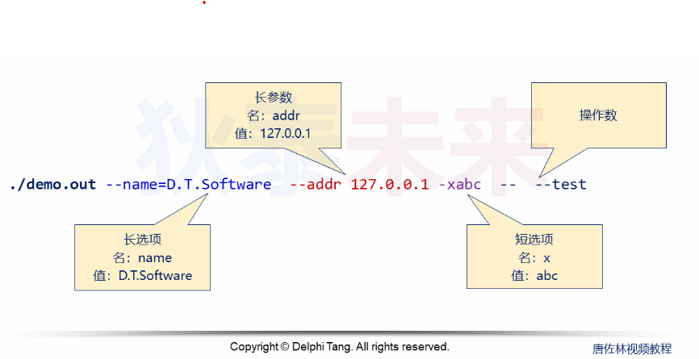

- [进程长参数编程](#进程长参数编程)
  - [回顾](#回顾)
  - [长参数规范](#长参数规范)
  - [长参数编程](#长参数编程)

# 进程长参数编程

## 回顾

短选项:

* 由选项, 选项值, 操作数组成
* 选项由短横线```-```开始, 选项名必须是单个字符或数字字符
* 选项可以由选项值, 选项与选项值之间可用空格分隔 ```-o test <==> -otest```
* 如果多个选项均无选项值, 可合而为一 ```-a -b <==> -ab```
* 既不是选项, 也不是选项值的参数是操作数
* 第一次出现的双横线```--```, 用于结束所有选项, 后面的参数均为操作数

## 长参数规范

* 由选项, 选项值, 操作数组成
* 选项由双横线```--```开始, 选项名可以是有意义的字符串
* 选项可以由选项值, 选项与选项值之间可用空格分隔 ```-o test <==> -otest```
* 如果多个选项均无选项值, 可合而为一 ```-a -b <==> -ab```
* 既不是选项, 也不是选项值的参数是操作数
* 第一次出现的双横线```--```, 用于结束所有选项, 后面的参数均为操作数

示例:


## 长参数编程

```C
#include <getopt.h>

struct option {
    const char *name;
    int         has_arg;
    int        *flag;
    int         val;
};

int getopt_long(int argc, char * const argv[],
            const char *optstring,
            const struct option *longopts, int *longindex);
```

参数解析：

* ```name```: 选项名
* ```has_arg```: 是否带参数一般是 ```no_argument``` 或者 ```required_argument``` 或者 ```optional_argument```
* ```flag```: 如果该参数为空则 函数返回短参数字符即```val```, 否则, 会将结果设置到这里指向的内存空间
* ```val```: 短选项

函数解析：

* ```getopt_long```从```argc```和```argv```中获取选项
* ```getopt_long```同时支持长选项和短选项  
  * 短选项: 通过字符判断规则参数```optstring```
  * 长选项: 通过```struct option```结构体
* **注意```struct option```结构体数组最后一项必须是全空的**

示例:

```C
#include <unistd.h>
#include <getopt.h>
#include <stdio.h>

int main(int argc, char* argv[])
{
    int add = 1;
    int sub = 2;
    struct option long_options[] = {
        {"add", required_argument, 0, 'a'},
        {"sub", required_argument, 0, 's'},
        {"mul", required_argument, 0, 'm'},
        {0    , 0                , 0   , 0}
    };

    int index = 0;
    int ret = 0;

    while((ret = getopt_long_only(argc, argv, ":n:l::", long_options, &index)) != -1)
    {
        if(ret)
        {
            if(ret != '?')
                printf("for short %c %s\n", ret, optarg);
        }
    }
}
```

```C
#include <unistd.h>
#include <getopt.h>
#include <stdio.h>

int main(int argc, char* argv[])
{
    int add = 1;
    int sub = 2;
    int flag = 2;
    struct option long_options[] = {
        {"add", required_argument, &flag, 'a'},
        {"sub", required_argument, &flag, 's'},
        {"mul", required_argument, &flag, 'm'},
        {0    , 0                , &flag   , 0}
    };

    int index = 0;
    int ret = 0;

    while((ret = getopt_long_only(argc, argv, ":n:l::", long_options, &index)) != -1)
    {
        if(ret)
        {
            if(ret != '?')
                printf("for short %c %s\n", ret, optarg);
        }
        else
        {
            printf("for long %s %c %s\n", long_options[index].name, *long_options[index].flag, optarg);
        }
    }
}
```
